如今国人已经越来越重视版权了。 而用CC0 授权的图片不用担心版权的问题，那么什么是CC0授权呢？简单来说就是「公共领域贡献宣告」授权，当创作者在自身作品使用 CC0 授权时，代表于符合法律规定的最大范围内，抛弃其对于作品拥有的著作权，当然这些内容就可以被任何人以任何方式使用，包括商业目的。选择以 CC0 授权的相片素材是相当安全且合法的。

如果你的工作或日常需要用到图片素材，可能会为了寻找几张免费的图片而浪费了大量的时间和精力。之前给大家介绍过免费的高分辨率图库re:splashed，今天再给大家推荐一些很不错的CC0授权图库。
## 1、Stokpic
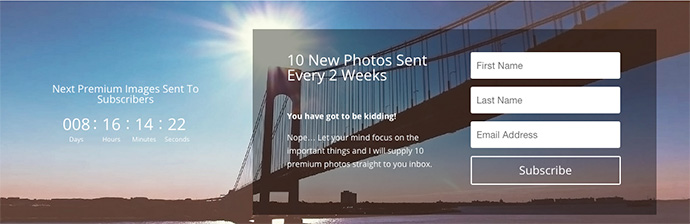
10个可用于商业用途的免费 CC0 授权的高分辨率图库
Stokpic 上有各种高品质、高解析度的相片素材，网站提供多种照片分类，包括：抽象、动物、建筑、背景、黑白、流行时尚、美食、景观、生活、活动、自然、物品、人物、运动和科技及交通运输，种类丰富，找到你喜爱的相片后，点选下载即可使用。

> 网站名称：Stokpic
网站链结：http://stokpic.com/

2、Pixabay
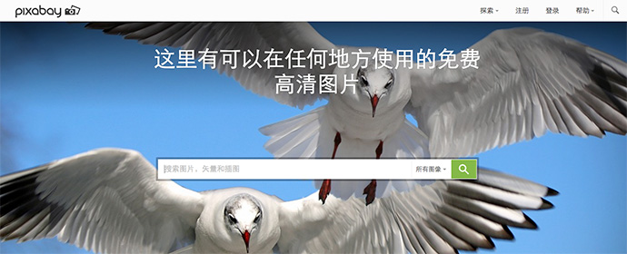
10个可用于商业用途的免费 CC0 授权的高分辨率图库
Pixabay是一个有超过三十万张免费相片、向量图与艺术插图素材的图库，均可可用于商业用途。直接在 Pixabay 首页输入要查找的图片关键字，或者点选首页挑选的精选图片，就能找到相关的搜寻结果。下载图片需要注册并登陆后才可以，还好注册账号也不是很麻烦。如果你本身也是个摄影师，也可以上传自己的作品供其他人下载使用，只要上传超过十张，便能去除网站上的广告。

> 网站名称：Pixabay
网站链结：http://pixabay.com/

3、FindA.Photo
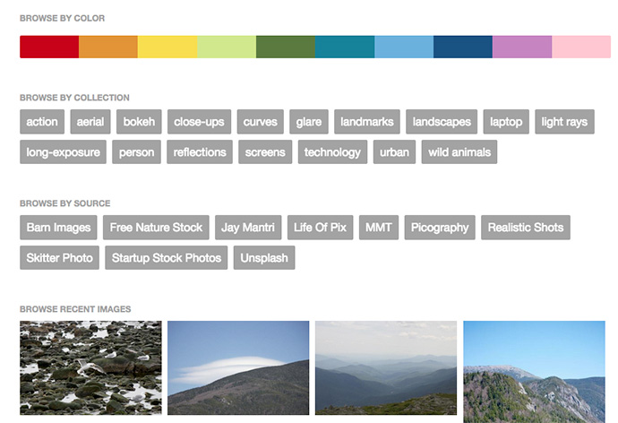
10个可用于商业用途的免费 CC0 授权的高分辨率图库
FindA.Photo 使用方法非常简单，打开网站后，直接输入你要查找的相片关键字（使用英文），这是最基本的用法。此外，你还可以利用颜色、标签、来源进行筛选、查找。使用颜色来筛选相片是一个很酷的搜寻方法。点击任一相片后，会进入它的详细页面，里面包含大图预览、标签、色彩和来源等一应俱全。点击「Download」就能将相片原图下载了！

> 网站名称：FindA.Photo
网站链结：http://finda.photo/

4、Unsplash
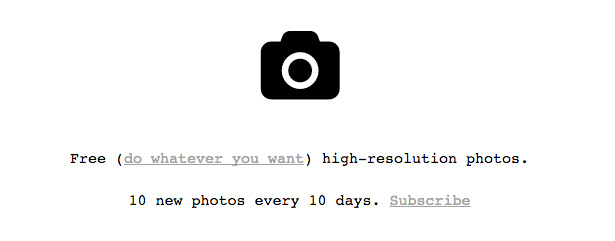
10个可用于商业用途的免费 CC0 授权的高分辨率图库
Unsplash是一个高解析度免费图库素材， 从 2013 年五月开始更新，更新频率为每 10 天会有 10 张新图上线，从 Archive 页面可以找到目前为止更新的所有图片内容。

> 网站名称：Unsplash
网站链结：http://unsplash.com/

5、TurboPhoto
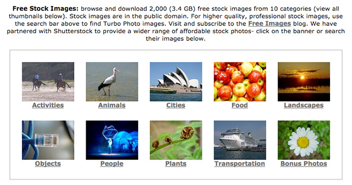
10个可用于商业用途的免费 CC0 授权的高分辨率图库
TurboPhoto 本身主要是贩售高画质图片的网站，但有提供一个免费图库素材集，提供多达 2,000 张（3.4 GB）的免费照片，包含10个分类：动物、城市、食物、人物、交通工具等等，这些商业图片都可以公开使用，对于工作或是日常生活需要找寻图片素材的人来说是个不错的选择。直接点选分类，就可以看到图片的小型预览图，点选预览图后就能看到原始图片。

> 网站名称：TurboPhoto
网站网址：http://www.turbophoto.com/Free-Stock-Images/

6、Stock Up
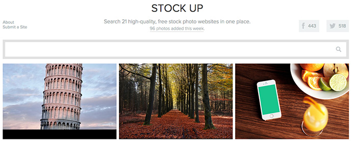
10个可用于商业用途的免费 CC0 授权的高分辨率图库
Stock Up 收录了包括 Unsplash、Life of Pix、New Old Stock、Startup Stock、Jay Mantri 等九个图库网站的相片，用户只要输入关键字，即可搜寻出相关结果，再从结果中找到你所需要的图片，将它复制、另存为并运用到其他的地方。Stock Up 只支持英文关键字，简单输入要查找的相片主题，即可快速从这些网站内找出相关内容。Stock Up 预设会搜寻所有的图库，你也可以选择、指定搜寻其中的某个网站。点选你想要下载、使用的图片后，会开启并链接到原始网站，你只需要点选 Download 或将图片另存为，即可使用这些免费的图库内容。

> 网站名称：Stock Up
网站链结：http://www.sitebuilderreport.com/stock-up

7、StreetWill
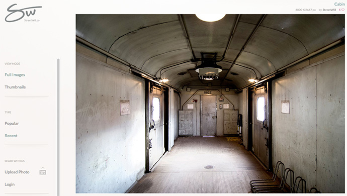
10个可用于商业用途的免费 CC0 授权的高分辨率图库
StreetWill.co提供的免费相片种类不多，而且也没有很复杂庞大的分类功能，不过它的特色是网站内所收录的相片都是高画质、高解析度，有些大小甚至达 4896 x 3264。

> 网站名称：StreetWill
网站链结：http://streetwill.co/

8、StockSnap.io
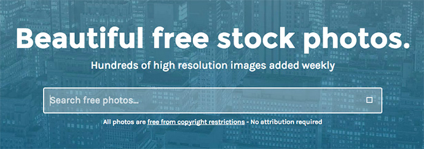
10个可用于商业用途的免费 CC0 授权的高分辨率图库
StockSnap.io 的网站目的很简单，希望能为寻找美丽图片的用户提供一个完整且丰富的资料库，网站每天都会从摄影师上传的相片中，找出高品质、高解析度的照片并更新至网站，让其他人可以免费下载、运用。除此之外，为了方便用户浏览，也可利用新增日期、趋势、查看次数、下载次数等方式来排序网站内的相片。

> 网站名称：StockSnap.io
网站链结：https://stocksnap.io/

9、Zerospace
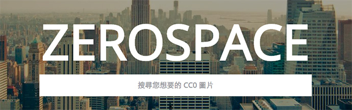
10个可用于商业用途的免费 CC0 授权的高分辨率图库
Zerospace 提供网上搜集来的高品质 CC0 图片,可以自由下载使用,不用担心版权问题。同时也可以上传自己拍的图片。

> 网站名称：StockSnap.io
网站链结：http://zerospace.asika.tw/

10、Negative Space
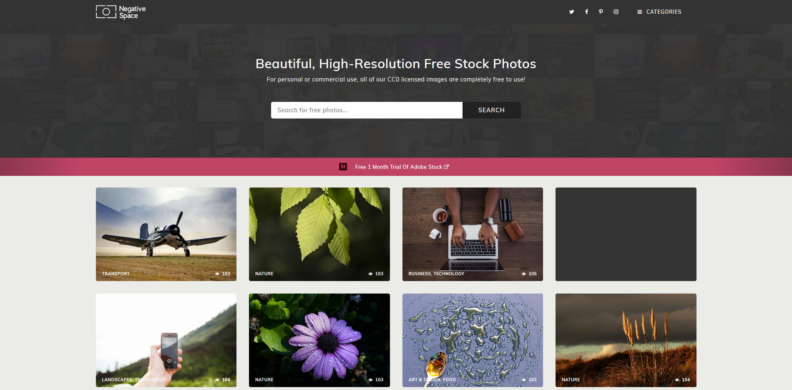

Negative Space收集的相片数量不多，大约只有五百张左右，但类型很全面，例如动植物、建筑、黑白、风景、食物、大自然、人物、运动、科技和运输等等相片应有尽有，使用者可直接在网站里预览、下载，无须注册帐号。

> 网站名称：Negative Space
网站链结：https://www.negativespace.co/

11、Fancycrave
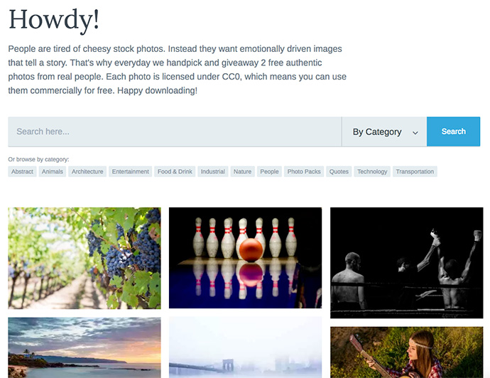
10个可用于商业用途的免费 CC0 授权的高分辨率图库
Fancycrave 是一款免费图库，不以图片数量取胜，而是坚持每天手工挑选，只更新两张来自真实使用者的相片素材，这些图片都以 CC0 授权方式释出，这意味著无论是个人或商业用途都可自由下载。如果有兴趣的话，Fancycrave 也提供各种主题的图库集，帮助你从众多同类型图片中找出适合自己的素材。

> 网站名称：Fancycrave
网站链结：http://fancycrave.com/

12、摄图网

10个可用于商业用途的免费 CC0 授权的高分辨率图库
摄图网图片素材皆为 100% 正版，可做为商业用途，并能下载无浮水印的高画质原图。网站收录各种相片类型，包括：人物、地标、动物、背景、商业、教育、健康医疗、音乐、科技、交通运输、自然、美食、美容时尚、建筑、科技、工艺、旅游与宗教等等，也能运用搜寻功能，以关键字查找相关相片。

仅提供免费会员一天 3 张超大图片下载权益，不过对于小量使用来说其实还算足够，通过底部页尾网站链接注册，就能获得 7 天免费 VIP 升级！在这期间每天可下载图片数量有 20 张，下载速度也会大幅提升。

> 网站名称：摄图网
网站链结：http://699pic.com/

13、Photock
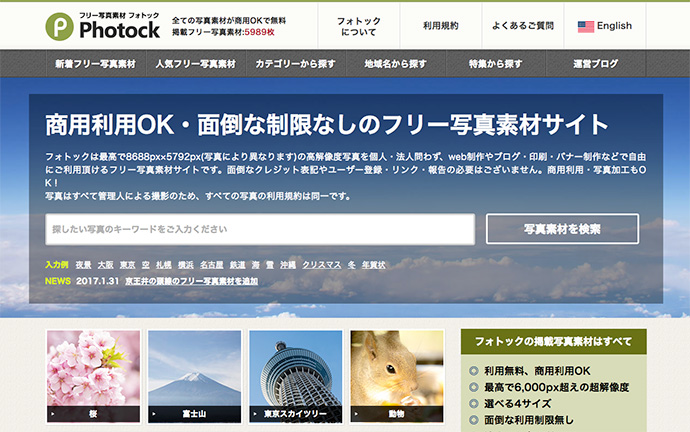
10个可用于商业用途的免费 CC0 授权的高分辨率图库
Photock 收录的相片使用 CC0 授权，可用于商业用途，例如创作、印刷或广告横幅，不用繁琐的注册或登录，当然也没有强迫必须要标注出处或连回原网站。每张照片都提供四种大小尺寸，如果你平常工作会用到日本相关场景，自己又无法拍出这么有质感的画面，Photock 依照各个地区来分类相片，或许使用这些素材可以让你的文章或粉丝页面增添更多风采。

> 网站名称：Photock
网站链结：https://www.photock.jp/

14、Visual Hunt
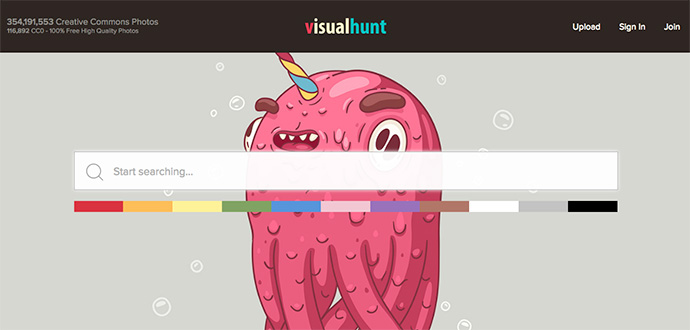
10个可用于商业用途的免费 CC0 授权的高分辨率图库
Visual Hunt 主要目的是将所有免费图片集中在一起。他们从网络上许多图库来源，以及其他免费资源来获取这些素材，这些相片多半是以 Creative Commons（CC）授权，同时也从 Flickr 或其他公共领域相片来取得素材，让使用者可以直接从网站内搜寻，找到自己需要的相片。

> 网站名称：Visual Hunt
网站链结：http://visualhunt.com/

15、Barn Images
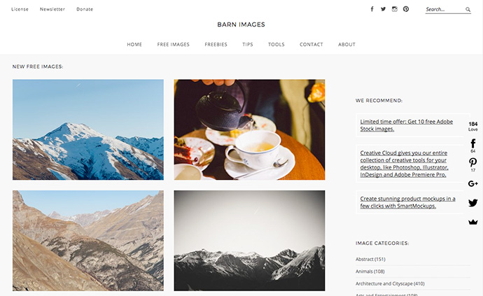
10个可用于商业用途的免费 CC0 授权的高分辨率图库
Barn Images 以收集免费、高画质且非图库性质的摄影相片为主，由两位来自拉脱维亚的摄影师创立，他们有非常丰富的摄影工作经验，决定把自己拍摄的照片释出，开放让更多来自世界各地的使用者能免费下载、使用。

> 网站名称：Barn Images
网站链结：https://barnimages.com/

16、Travel Coffee Book
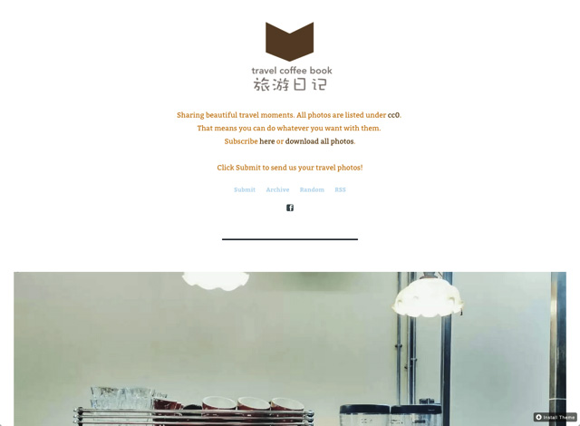
10个可用于商业用途的免费 CC0 授权的高分辨率图库
Travel Coffee Book 中文名称为「旅游日记」，网站内容恰如其名，主要以提供在旅游中拍摄的相片为主。你可以找到许多精美的摄影作品，没有固定主题，依照时间排列显示。比较特别的是网站将所有图片更新、上传至 OneDrive ，如果你需要大量相片的话甚至可以一键全部下载保存，非常方便。

> 网站名称：Travel Coffee Book
网站链结：http://travelcoffeebook.com/

17、Skuawk

10个可用于商业用途的免费 CC0 授权的高分辨率图库
Skuawk 不同于一般的免费图库，它并不是以数量取胜，不过本身收录的相片都非常具有质感，提供包括自然、城市、科技、人物、物品、野生动物等主题。

> 网站名称：Skuawk
网站链结：http://skuawk.com/

18、FreePhotos.cck
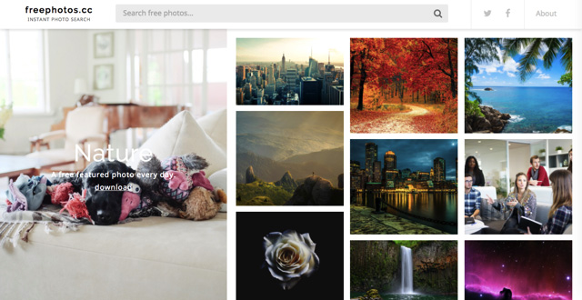
10个可用于商业用途的免费 CC0 授权的高分辨率图库
FreePhotos.cc 结合多个免费图库网站，使用 API 串接各个服务，最终让图库相片在单一网站页面上显示出来，使用者可以快速找到所有图库内容，一键下载，没有广告、无须注册登入是这项服务的最大特色。

> 网站名称：FreePhotos.cc
网站链结：https://freephotos.cc/

19、Burst
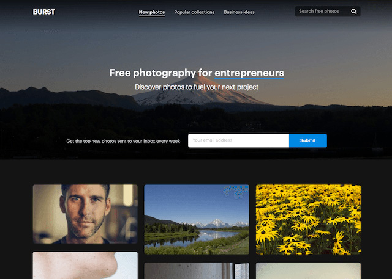
10个可用于商业用途的免费 CC0 授权的高分辨率图库
Burst 免费图库背后是知名的加拿大电子商务公司 Shopify，根据网站说明，会推出这麽一个免费图库的原因在于协助企业家做出更好的产品、网站或行销活动，大部分相片都是内部拍摄的原始图片，当然也有一些比较普遍看到的主题，例如：美食、夕阳或山丘等等。开站初期已经收录 1,000 张以上的高画质相片素材。

> 网站名称：Burst
网站链结：https://burst.shopify.com/

20、Peakpx
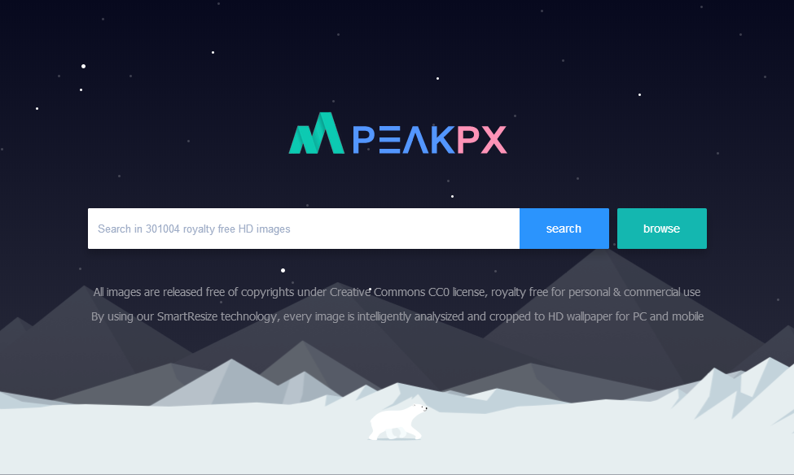
10个可用于商业用途的免费 CC0 授权的高分辨率图库
Burst 免费图库背后是知名的加拿大电子商务公司 Shopify，根据网站说明，会推出这麽一个免费图库的原因在于协助企业家做出更好的产品、网站或行销活动，大部分相片都是内部拍摄的原始图片，当然也有一些比较普遍看到的主题，例如：美食、夕阳或山丘等等。开站初期已经收录 1,000 张以上的高画质相片素材。

> 网站名称：Peakpx
网站链结：http://www.peakpx.com/

