可能是大屏数据可视化设计介绍最详尽的一篇文章，帮你尽量躲开大屏数据可视化路上那些坑。

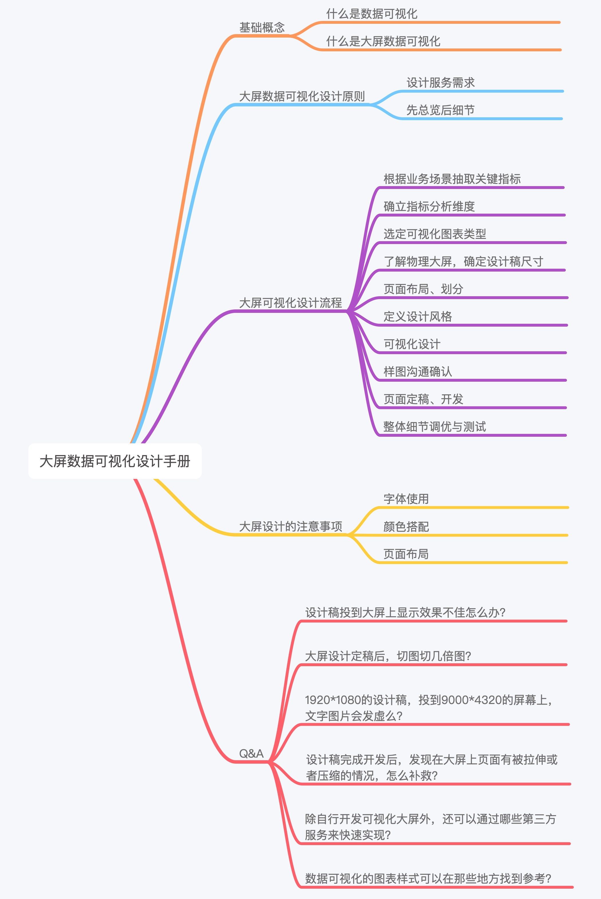

<h4>文章目录</h4>
<ol class=" list-paddingleft-2">
 	<li>基础概念</li>
 	<li>大屏数据可视化设计原则</li>
 	<li>大屏可视化设计流程</li>
 	<li>大屏设计的注意事项</li>
 	<li>Q&A</li>
 	<li>总结</li>
</ol>
<h4>基础概念</h4>
<strong>1. 什么是数据可视化</strong>

把相对复杂、抽象的数据通过可视的方式以人们更易理解的形式展示出来的一系列手段叫做数据可视化，数据可视化是为了更形象地表达数据内在的信息和规律，促进数据信息的传播和应用。

在当前新技术支持下，数据可视化除了「可视」，还有可交流、可互动的特点。数据可视化的本质是数据空间到图形空间的映射，是抽象数据的具象表达。

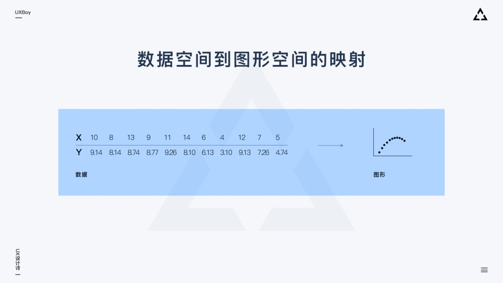

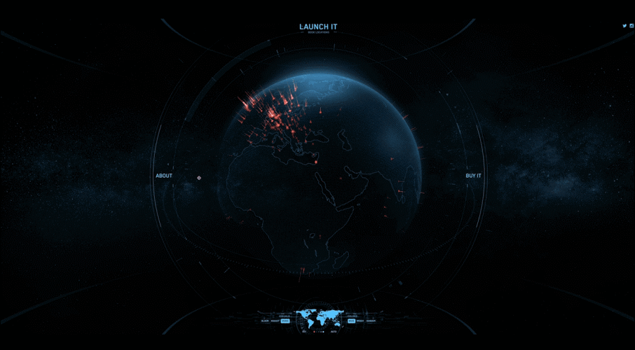

△ 数据可视化作品《 launchit 》，作者：Shane Mielke

作者写了本书，地图上显示了世界各地读者的分布情况及对应人数。

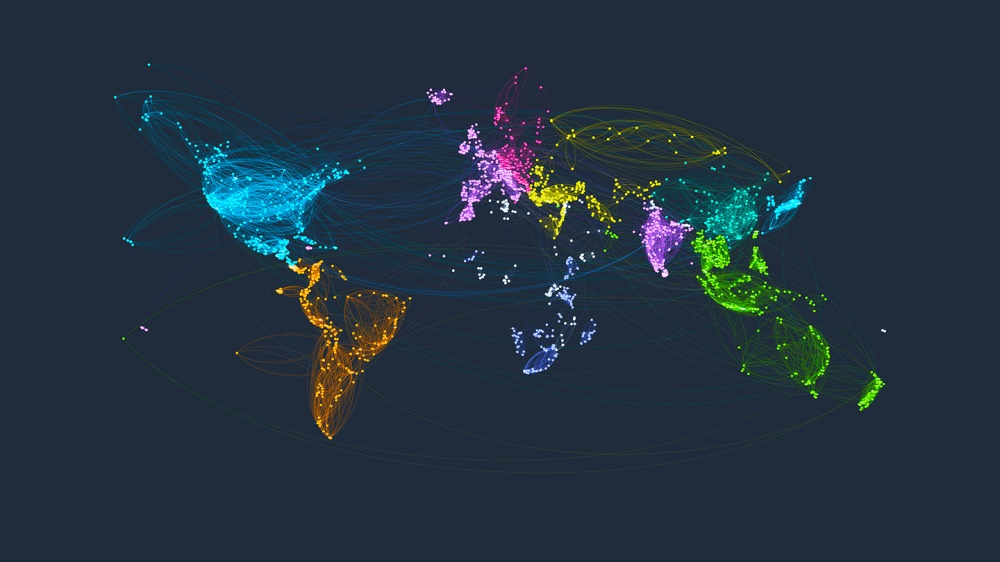

△ 数据可视化作品《 world-drawn-by-travelers 》，作者：TripHappy

国家之间相互连通的旅游路线，颜色越相近的国家，表明两个国家的人们互动越频繁。

<strong>2. 什么是大屏数据可视化</strong>

大屏数据可视化是以大屏为主要展示载体的数据可视化设计。

「大面积、炫酷动效、丰富色彩」，大屏易在观感上给人留下震撼印象，便于营造某些独特氛围、打造仪式感。电商双11时大屏利用此特点打造了热烈、狂欢的节日氛围，原本看不见的数据可视化后，便能调动人的情绪、引发人的共鸣，传递企业文化和价值。

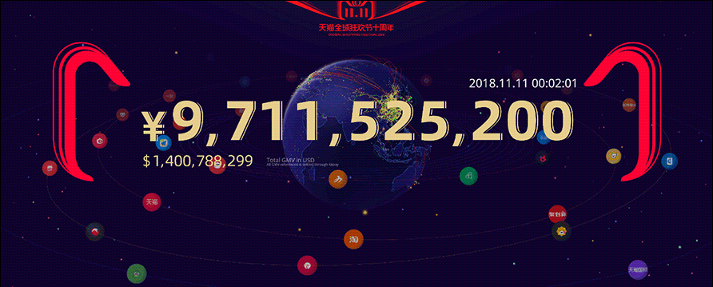

利用面积大、可展示信息多的特点，通过关键信息大屏共享的方式可方便团队讨论和决策，故大屏也常用来做数据分析监测使用。大屏数据可视化目前主要有信息展示、数据分析及监控预警三大类。

数据分析类：

△ 图片来源：必应，图片作者：帆软软件有限公司
<h4>大屏数据可视化设计原则</h4>
大屏数据可视化设计原则：设计服务需求、先总览后细节。

<strong>1. 设计服务需求</strong>

大屏设计要避免为了展示而展示，排版布局、图表选用等应服务于业务，所以大屏设计是在充分了解业务需求的基础上进行的。那什么是业务需求呢？业务需求就是要解决的问题或达成的目标。设计师通过设计的手段帮助相关人员达成这个目标，是大屏数据可视化的价值所在。

<strong>2. 先总览后细节</strong>

大屏因为大，承载数据多，为了避免观者迷失，大屏信息呈现要有焦点、有主次。可以通过对比，先把核心数据抛给用户，待用户理解大屏主要内容与展示逻辑后，再逐级浏览二三级内容。部分细节数据可暂时隐藏，用户需要时可通过鼠标点击等交互方式唤起。
<h4>大屏可视化设计流程</h4>
规范的流程是好结果的保证。找到一个可参考的流程，然后步步为营，就能避免很多不必要的返工，保证设计质量和项目进度。

<h5>1. 根据业务场景抽取关键指标</h5>
关键指标是一些概括性词语，是对一组或者一系列数据的统称。一般情况下，一个指标在大屏上独占一块区域，所以通过关键指标定义，我们就知道大屏上大概会显示哪些内容以及大屏会被分为几块。以共享单车电子围栏监控系统为例，这里的关键指标有：企业停车时长、企业违停量、热点违停区域、车辆入栏率等。

确定关键指标后，根据业务需求拟定各个指标展示的优先级（主、次、辅）。

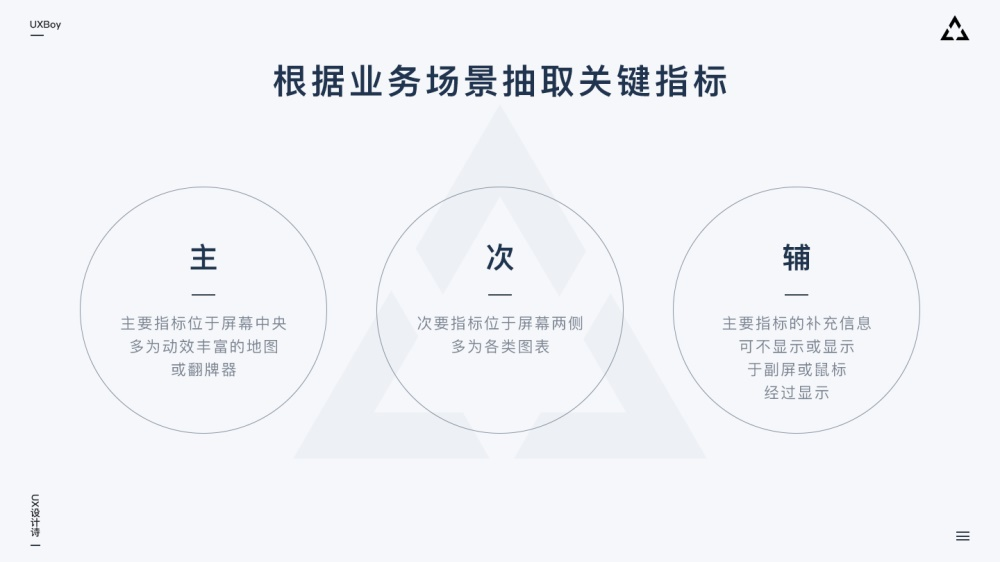
<h5>2. 确立指标分析维度</h5>
「横看成岭侧成峰」。同一个指标的数据，从不同维度分析就有不同结果。很多小伙伴做完可视化设计，发现可视化图形并没有准确表达自己的意图，也没能向观者传达出应有的信息，可视化图形让人困惑或看不懂。出现这种情况很大程度就是因为分析的维度没有找准或定义的比较混乱。

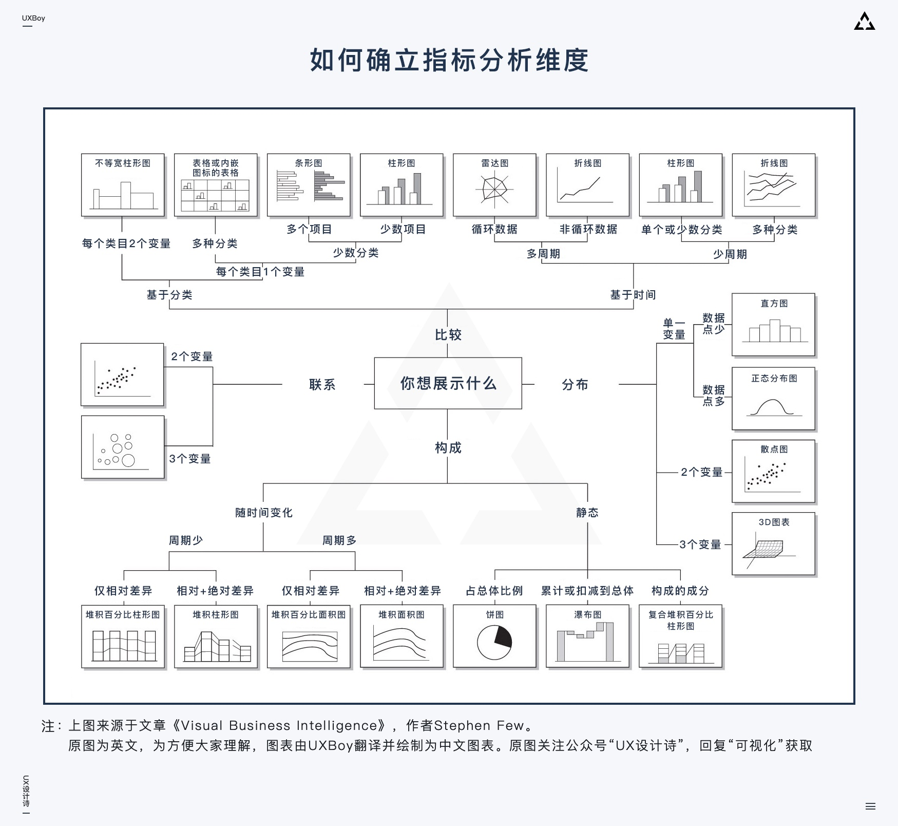

上图向大家展示了数据分析常用的4个维度，我们在选定指标后，就需要跟项目组其他小伙伴讨论：我们的各个指标主要想给大家展示什么，更进一步的讲，是我们想通过可视化表达什么样的规律和信息。而上图，可以引导我们从「联系、分布、比较、构成」四个维度更有逻辑的思考这个问题。
<ul class=" list-paddingleft-2">
 	<li>联系：数据之间的相关性。</li>
 	<li>分布：指标里的数据主要集中在什么范围、表现出怎样的规律。</li>
 	<li>比较：数据之间存在何种差异、差异主要体现在哪些方面。</li>
 	<li>构成：指标里的数据都由哪几部分组成、每部分占比如何。</li>
</ul>
当然，上图例举的示例图表都比较传统，在大屏数据可视化中常还有另一类地理信息（常以2/3D地图、地球呈现）出现。上图虽未包含这类图形，但它提供给我们的确定数据分析维度的思路和方法是相通的，可借鉴。
<h5>3. 选定可视化图表类型</h5>
当确定好分析维度后，事实上我们所能选用的图表类型也就基本确定了。接下来我们只需要从少数几个图表里筛选出最能体现我们设计意图的那个就好了。

选定图表注意事项：易理解、可实现。

<strong>易理解</strong>

可视化设计要考虑大屏最终用户，可视化结果应该是一看就懂，不需要思考和过度理解，因而选定图表时要理性，避免为了视觉上的效果而选择一些对用户不太友好的图形。

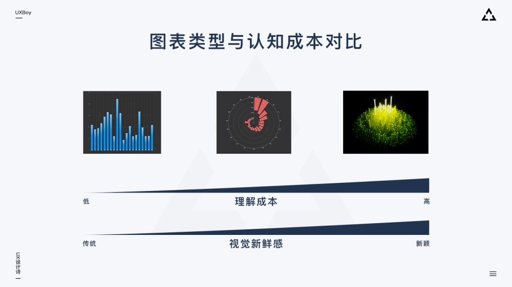

<strong>可实现</strong>

我们需要了解现有数据的信息、规模、特征、联系等，然后评估数据是否能够支撑相应的可视化表现。

我们设计的图形图表，要开发能够实现。实际工作中，一些可视化效果开发用代码写很容易实现，效果也不错，但这些效果设计师用 Ps / Ai / Ae 这些工具模拟时会发现比较困难；同样的，某些效果设计师用设计工具可以轻易实现，但开发要用代码落地却非常困难，所以大屏设计中跟开发常沟通非常重要，我们需要明确哪些地方设计师可以尽情发挥，哪些地方需要谨慎设计。一个项目总有周期与预算限制，不会无限期的修改迭代，所以设计师在这里需要抓住重点，有取舍，不钻牛角尖、不死磕不放。

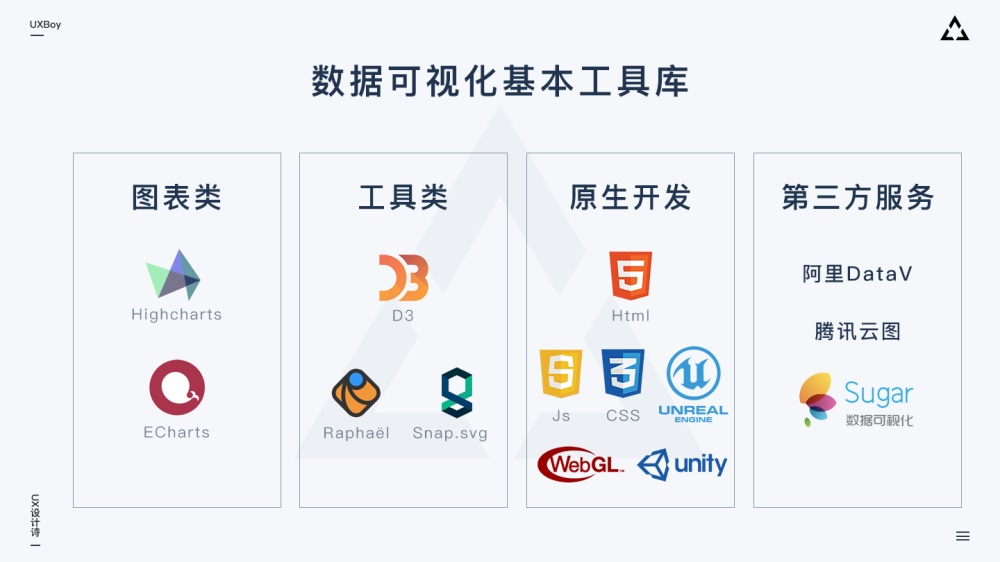
<h5>4. 了解物理大屏，确定设计稿尺寸</h5>
多数情况下设计稿分辨率即被投大屏的信号源电脑屏幕的分辨率。有多个信号源时，就会有多个设计稿，此时每个设计稿的尺寸即对应信号源电脑屏幕的分辨率。

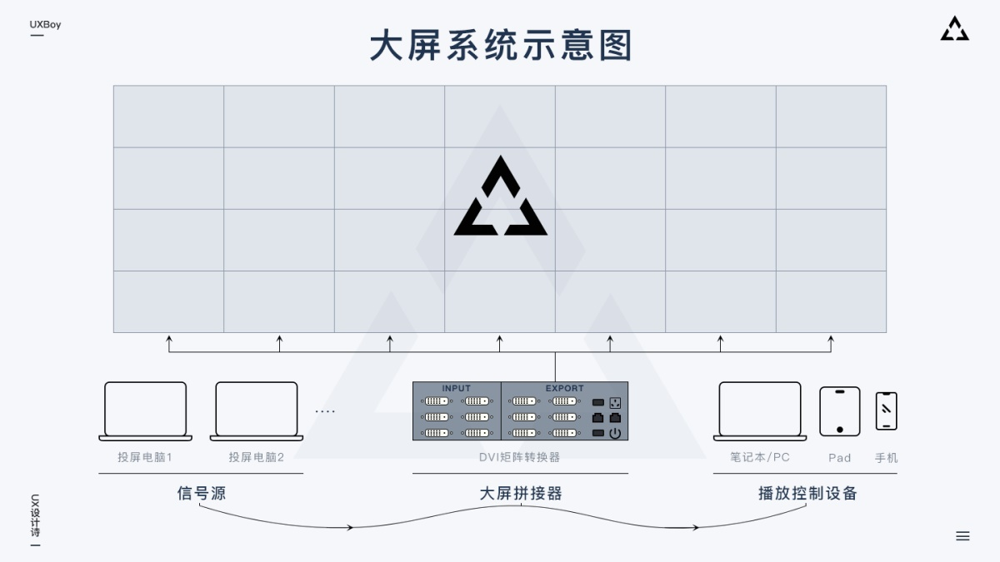

一般情况下设计稿的分辨率就是电脑的分辨率，当有多个信号源时，有时会通过显卡自定义电脑屏幕分辨率，从而使电脑显示分辨率不等于其物理分辨率，此时，对应设计稿的分辨率也就变成了设置后的分辨率。此外，当被投电脑分辨率长宽比与大屏物理长宽比不一致时（单信号源），也会对被投电脑屏幕分辨率做自定义调整，这种情况设计稿分辨率也会发生变化。所以设计开始前了解物理大屏长宽比很重要。
<h5>5. 页面布局、划分</h5>
尺寸确立后，接下来要对设计稿进行布局和页面的划分。这里的划分，主要根据我们之前定好的业务指标进行，核心业务指标安排在中间位置、占较大面积；其余的指标按优先级依次在核心指标周围展开。一般把有关联的指标让其相邻或靠近，把图表类型相近的指标放一起，这样能减少观者认知上的负担并提高信息传递的效率。

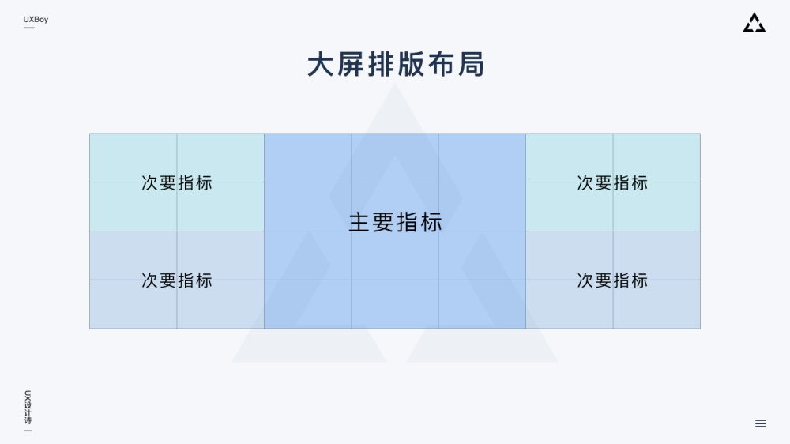
<h5>6. 定义设计风格</h5>
很多小伙伴也许没接触过大屏设计工作，但大多数人都应该有 APP 或者 Web 风格定义的经验。我们在定义一款 APP 或者 Web 页面设计风格时常用的方法是什么呢？情绪板。

大屏虽酷炫，但实际上也是运行在浏览器里的 Web 页面，所以大屏设计风格定义方法也同样可以用情绪板来做，这种方法也是目前比较科学高效的风格定义手段。

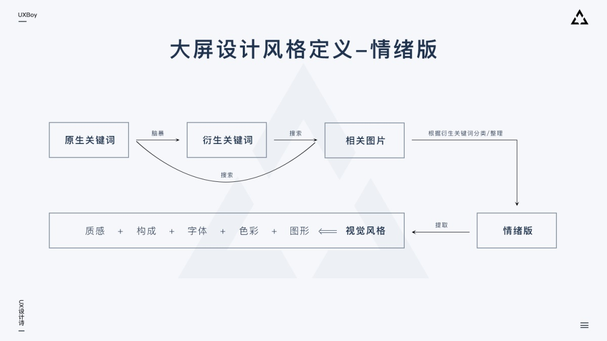

上图提供了情绪板应用的脑图，具体操作细节不做介绍，不太了解的小伙伴可以自己找找资料。

编者按：一篇好文帮你扫盲，运用情绪板搞定设计→<a href="https://www.uisdc.com/mood-board-improve-persuasive" target="_blank" rel="noopener noreferrer">《该怎么运用情绪板，才能让设计作品更有说服力？》</a>

情绪板的一套流程下来，我们定义的风格基本是科学准确的，可以指导我们执行设计。如果是给甲方做大屏，这个流程也可以让我们提出的方案更有说服力。
<h5>7. 可视化设计</h5>
根据定义好的设计风格与选定的图表类型进行合理的可视化设计。目前来说大屏可视化主要有指标类信息点和地理类信息点两大可视化数据。指标类信息点可视化效果相对简单易实现，而地理类信息点一般可视化效果酷炫，但是开发相对困难，需要设计师跟开发多沟通。地理类信息一般具有很强的空间感、丰富的粒子、流光等动效、高精度的模型和材质以及可交互实时演算等特点，所以对于被投电脑、大屏拼接器等硬件设备的性能会有要求，硬件配置不够的情况下可能出现卡顿甚至崩溃的情况，所以这点也是需要提前沟通评估的。

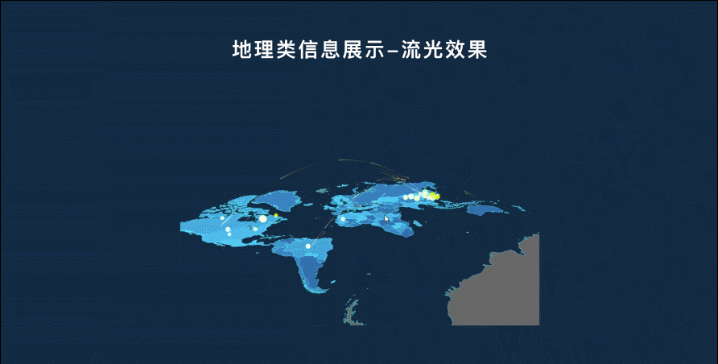
<h5>8. 样图沟通确认</h5>
这里的沟通分三个层面：设计师对内沟通、设计师对外沟通、设计师与大屏的「沟通」。

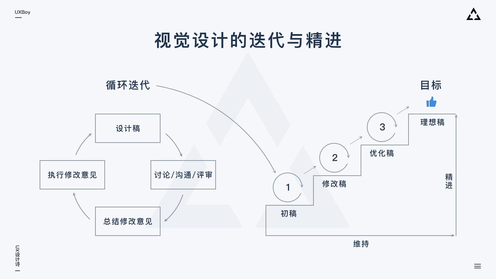

样图沟通环节，最初的样图不需要十分精致，我们可以把它理解为一个「低保真」原型，然后通过不断沟通修改，让它逐步完善精致起来，也就是小步快跑，避免那种一下子走到终点，然后又大修大改的情况。

因为我们在前几步已经分别确定了页面布局、图表类型、页面风格特点，所以这一步我们需要用尽可能简单的方法 ，把之前几步的成果在页面上快速体现出来，然后根据样图效果尝试确定五方面内容：
<ul class=" list-paddingleft-2">
 	<li>之前确立的布局在放入设计内容后是否依然合适；</li>
 	<li>确立的图表类型带入数据后是否仍然客观准确；</li>
 	<li>根据关键元素、色彩、结构、质感打造出的页面风格是否基本传达出了预期的氛围和感受；</li>
 	<li>已有的样式、数据内容、动效等在开发实现方面是否存在问题；</li>
 	<li>大屏是否存在色差、文字内容是否清晰可见、页面是否存在变形拉伸等现象。</li>
</ul>
跟大屏「沟通」是比较重要也是个特殊的环节，这也是我觉得大屏设计跟其它设计不一样的地方，大屏有它自己独特的分辨率、屏幕组成、色彩显示以及运行、展示环境，这里的很多问题只有设计稿投到大屏上才能够被发现，所以这一步在样图沟通确认环节非常重要，有时候需要开发出 demo，反复测试多次。
<h5>9. 页面定稿、开发</h5>
事实上页面开发阶段并不是到了这一步才进行，这里说的页面开发仅指前端样式的实现，实际上后台数据准备工作在定义好分析指标后就已经开始进行了，而我们当前的工作是把数据接入到前端，然后用设计的样式呈现出来。

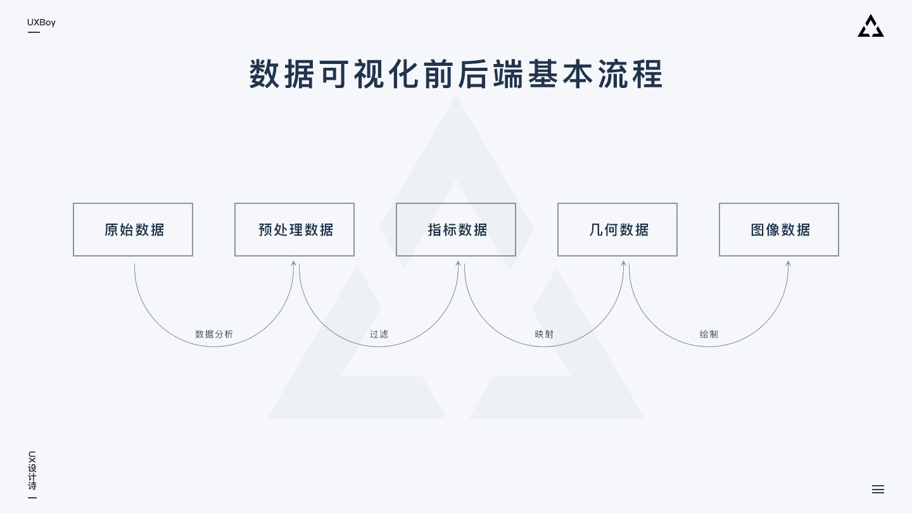

<strong>切图与标注</strong>

由于大屏实际就是一个 web 页面，所以开发阶段的切图与标注是少不了的。

切图：哪些元素需要切图，怎么切？

一般开发用代码写不出的样式或动效，都需要设计师切图作支持：比如数据容器的边框、小的动效、页面整体大背景、部分图标等。切图按正常网页设计标准切就可以了。

标注：Web页面用什么插件做标注这个大家都很熟悉，我就不多说了。需要注意的是，如果大屏页面需要在不同比例的终端展示，那么此时的标注与开发可以使用 rem 作为基本单位来实现，这样实现的大屏页面在后期会有更好的扩展性与适应性。
<h5>10. 整体细节调优与测试</h5>
这部分是指页面开发完成后，将真实页面投放到大屏进行的测试与优化。这里主要有两部分工作。

视觉方面的测试（有点像 APP 的 UI走查）：关键视觉元素、字体字号、页面动效、图形图表等是否按预期显示、有无变形、错位等情况。

性能与数据方面的测试：图形图表动画是否流畅、数据加载、刷新有无异常；页面长时间展示是否存在崩溃、卡死等情况；后台控制系统能否正常切换前端页面显示。
<h4>大屏设计的注意事项</h4>
<strong>1. 字体使用</strong>

字体优先使用系统默认字体，需要嵌入字体时考虑字体的可识别性、与当前设计风格是否融合、是否可免费商用。

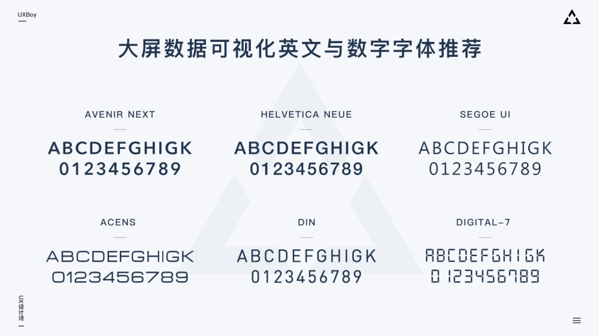

如果页面是云端部署，需要嵌入字体包时，我们可以使用 FontCreator 这类的软件把那些用不到的字符从字体包中删掉，然后重新打包上传，减小字体包大小，可以优化页面加载体验，避免在替换默认字体的过程中出现页面文字跳动等现象。（一般来讲一套字体文件包含了阿拉伯文、符号、拉丁文、日文、西里尔文、希腊文、拼音、注音符号等多种字符，对于大屏这个明确的场景，我们可以删掉其它使用不到的字符，仅保留中文、拼音和数字）

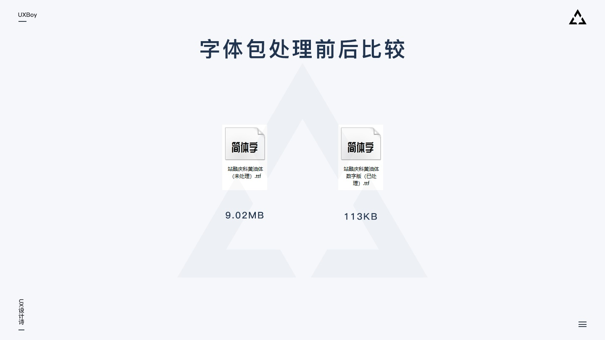

<strong>2. 颜色搭配</strong>

色彩明度与饱和度差异显著、对比鲜明， 尽量避免使用邻近色配色。

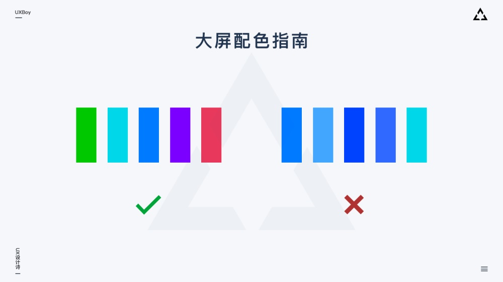

使用深色暗色背景：深色暗色背景可减少拼缝带来的不适感。由于背景面积大，使用暗色背景还能够减少屏幕色差对整体表现的影响；同时暗色背景更能聚焦视觉，也方便突出内容，做出一些流光、粒子等酷炫的效果。

渐变色慎重使用：大屏普遍色域有偏差，显示偏色，因而使用渐变色需要根据大屏反馈确定是否调整，纯色最佳。

<strong>3. 页面布局</strong>

主次分明、条理清晰、注意留白，合理利用大屏上各个小的显示单元，并尽量避免关键数据被拼缝分割。

<h4>Q&A</h4>
<strong>1. 设计稿投到大屏上显示效果不佳怎么办？</strong>

大屏的分辨率、比例、使用环境、投射方式等均会对设计造成影响。理想情况下，我们应该在设计开始前，就能打开大屏系统做一些简单测试。我们可以从网上收集不同设计师不同风格的大屏设计作品，然后投上去查看实际效果。因为大多数时候大屏都会存在色彩偏差，这时通过测试我们就能发现渐变色、邻近色等不同类型的色彩搭配是否可以在目标大屏上良好呈现，如果不可以，那我们设计进行时就不要使用显示效果不佳的色彩搭配。另一方面，样图沟通环节及时测试也很重要。

<strong>2. 大屏设计定稿后，切图切几倍图？</strong>

由于是将我们电脑屏幕投射到了大屏，大屏上的内容是运行在我们电脑浏览器上的页面。所以切图根据我们电脑的分辨率，正常切1倍图就可以了。

<strong>3. 1920*1080的设计稿，投到9000*4320的屏幕上，文字图片会虚么？</strong>

看情况，视大屏系统硬件规格与观看距离来定。这块有四个概念需要跟大家交流一下。

大屏逻辑分辨率（设计稿尺寸）、显卡输出分辨率、视频矩阵切换器（ DVI ）支持分辨率、大屏实际物理分辨率。

一般后两个是没问题的，大屏跟矩阵切换器是由大屏厂商提供，一般刚好配套大屏。容易出问题的是显卡输出分辨率，我们电脑屏幕分辨率并不是最终显卡传递到 DVI 接口的分辨率，传递到 DVI 接口的分辨率是电脑显卡所能输出的最大分辨率（部分电脑可设置或自定义输出分辨率）。输出分辨率等于 DVI 支持分辨率时显示效果最佳。输出分辨率低于 DVI 支持分辨率，DVI 会将信号放大后传递到大屏，放大的过程中就有图像信息丢失，虽然此过程中有各种算法支持去保证图像尽可能清晰，但算法再好，跟真实图形还是有差距的。此外，多信号源投射效果优于单个信号源投射。对于现场直播数据大屏，一般至少有两个信号源，一个投屏，另一个也投屏但是处于备用状态。

离大屏的距离也影响观感，一般离得近，颗粒感明显，距离稍远，会显的较为清晰。

<strong>4. 设计稿完成开发后，发现在大屏上页面有被拉伸或者压缩的情况，怎么补救？</strong>

一般来讲，开发只需要对设计图做还原即可。但特殊情况下，比如显示器扩展不正确导致页面被拉伸或压缩，这时就需做处理：我们可以先得到被拉伸/压缩的比例，然后对整体视图做压缩/拉伸处理，再由其拉伸/压缩，这样被拉伸/压缩的瑕疵就可以得到一定程度上的矫正。另外，了解被投电脑硬件特点，有的电脑可以通过自定义分辨率解决这部分问题。

<strong>5. 除自行开发可视化大屏外，还可以通过哪些第三方服务来快速实现？</strong>

阿里云 DataV、腾讯云图、百度 Sugar 等。

<strong>6. 数据可视化的图表样式可以在哪些地方找到参考？</strong>

图表部分的二个库是我们设计师可以打开浏览查看的，这里面所有的图表样式都是基于代码实现的，可以作为我们设计图表的参考，也可以让开发拿代码去用，或者在这些图表的基础上修改。

工具类的需要有一定的代码基础，里面同样有丰富的图表，所以跟开发的沟通也很重要，因为他们可能会了解多一些更新的前沿的图表形式，是我们设计师不知道的，所以彼此多沟通交流实在太重要了。

<h4>总结</h4>
数据可视化是一门庞大系统的科学，本文所有讨论仅针对大屏数据可视化这一特定领域，管中窥豹，如有遗漏或不足之处欢迎大家讨论交流。