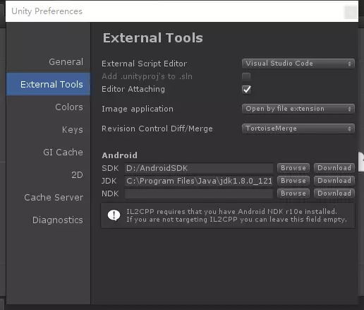
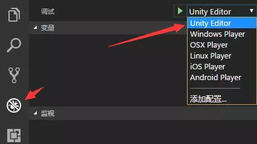
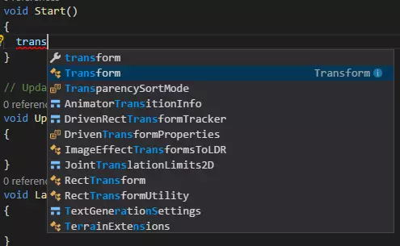

用VSCODE吧！CODE大法好！
本来是用code写前端页面，今天为了启用调试，上官网溜达了一圈，发现这货也能写unity3d，回来试了10分钟，当即决定弃用Visual Studio，哈哈哈。

## 先说设置启用
### unity中编辑器设为vscode

### vscode中安装两个插件

## 使用
安装完上面的debugger插件后，在debug那里设置unitydebug：

愉快玩耍吧，代码提示、格式化、调试一应俱全。

