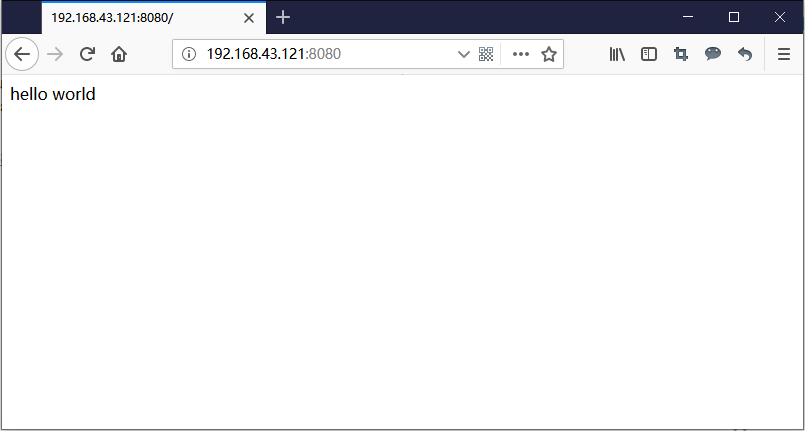

在上一篇教程中我们制作了nginx静态环境应用，感兴趣的小伙伴可查看[《10分钟制作一个nginx静态网站环境应用》](https://blog.csdn.net/qq_19812661/article/details/89599389)，那么本期教程将在这个基础上进行升级，我们将要制作一个php动态网站环境。
## 制作镜像

首先将上次做好的镜像从hub.docker.com上拉取回来，使用命令`docker pull `将yeqing112/alpine-nginx:0.0.1镜像拉取到本地：

```shell
root@ubuntu:~# docker pull yeqing112/alpine-nginx:0.0.1
0.0.1: Pulling from yeqing112/alpine-nginx
bdf0201b3a05: Already exists
0c854d799ec5: Pull complete
Digest: sha256:94c5f0c38a3de543cde52791b3daff3fdc8001e99bf58bb08230b2cab3e062a3
Status: Downloaded newer image for yeqing112/alpine-nginx:0.0.1
root@ubuntu:~#
```
启动并进入容器：

```shell
root@ubuntu:~# docker run -it --name php-fpm7-alpine  yeqing112/alpine-nginx:0.0.1 sh
/ #
```
安装php与相关扩展：

```shell
/ # apk add --no-cache php7 php7-ftp php7-pdo php7-mysqli php7-simplexml php7-xmlwriter php7-zlib php7-imagick php7-memcached php7-sockets php7-mcrypt php7-zip php7-pgsql php7-pdo_odbc php7-odbc php7-curl php7-iconv php7-xml php7-json php7-gd php7-session php7-opcache php7-pdo_sqlite php7-mbstring php7-fpm php7-common php7-pdo_mysql
```
这一口气我们安装了很多扩展，你可以根据实际需求减少或增加，之后简单设置一下nginx.conf，并在网站根目录下创建hello world页面。

退出容器

```shell
/ # exit
```
使用`docker commit`命令打包新镜像：

```shell
root@ubuntu:~# docker commit php-fpm7-alpine yeqing112/php-fpm7-alpine:0.0.1
sha256:b626d41e876e97957a98cfb52d37c87d1cd8ca1cb68500c6b708627350f93dca
root@ubuntu:~#
```
docker images查看镜像：

```shell
root@ubuntu:~# docker images
REPOSITORY                  TAG                   IMAGE ID            CREATED             SIZE
yeqing112/php-fpm7-alpine   0.0.1                 b626d41e876e        3 minutes ago       105MB
```
ok，镜像制作完成了，我们来简单运行一下看看吧

```shell
root@ubuntu:~# docker run -dit --name myphpsite -p 8080:80 yeqing112/php-fpm7-alpine:0.0.1 sh
```
我们把母机8080端口映射到了容器的80端口，docker ps查看一下容器：

```shell
root@ubuntu:~# docker ps
CONTAINER ID        IMAGE                                   COMMAND                  CREATED             STATUS              PORTS                                                                    NAMES
04b392e7ae75        yeqing112/php-fpm7-alpine:0.0.1         "sh"                     8 seconds ago       Up 6 seconds        0.0.0.0:8080->80/tcp                                                     myphpsite
```
我们通过http://ip:8080去访问页面看出，此时容器内的php和nginx并没有启动，现在需要进入容器内部手动启动php和nginx：

```shell
root@ubuntu:~# docker exec -it myphpsite sh
/ # php-fpm7 && nginx
/ #
```
将php和nginx启动后，这时我们用浏览器访问http://ip:8080 就可以看到hello world页面了。

#### 如何让容器内部服务自启动
网上有大量的教程教大家如何让容器内部服务自启动，但配置过程相对复杂，这里教大家一个比较取巧而简单的方法，利用Dockerfile构建镜像，在镜像中加入启动脚本即可。
首先新建一个Dockerfile文件：

```shell
root@ubuntu:~# vi Dockerfile
```
Dockerfile内容如下：

```shell
FROM yeqing112/php-fpm7-alpine:0.0.1
MAINTAINER yeqing "yeqing@qq.com"

EXPOSE 80
EXPOSE 443

CMD php-fpm7 && nginx && sh && exit
```
CMD这一行中就是让服务启动的命令，前两个大家一看就知道什么意思，后面的`sh`目的是让容器正常开启，如果没有`sh`的加入，容器是不能启动起来，最后一个`exit`就是退出容器的意思。

将Dcokerfile文件保存后，使用`docker build`命令构建镜像，将新镜像命名为`yeqing112/php-fpm7-alpine:0.0.2`

```shell
root@ubuntu:~# docker build -t yeqing112/php-fpm7-alpine:0.0.2 .
```
构建成功后。