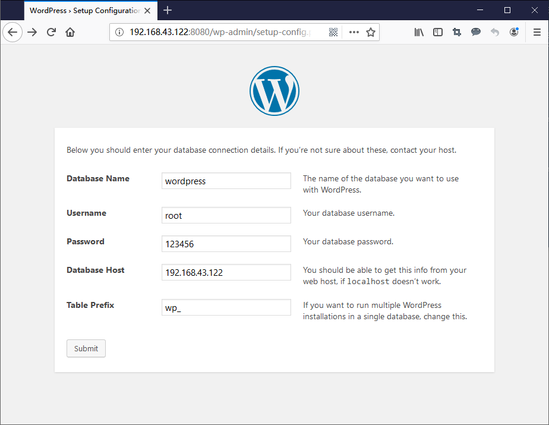

11当我们掌握了Docker镜像和容器的基本用法后，我们现在能做些什么事情呢？现在我们就来看看使用Docker容器如何安装常见的软件，然后运行一个动态网站。

下面我们来学习：

- 1、安装Nginx
- 2、安装PHP
- 3、使用MySQL服务
- 4、运行wordpress博客

## 安装Nginx

运行一个Alpine的容器，选择Alpine作为系统基础镜像是因为Alpine轻巧的体积，基础镜像只有5.53MB，相比ubuntu镜像的88.9MB要小十几倍。

```bash
root@ubuntu:~# docker run -it -p 8080:80 alpine sh
```

安装nginx

```bash
apk add nginx
```

修改nginx配置

```bash
vi /etc/nginx/conf.d/default.conf
```

default.conf内容如下：

```bash
server {
        listen 80 default_server;

        root /home/www;
        index index.php index.html;
}
```

创建Hello World

```bash
mkdir /home/www && echo "Hello World" > /home/www/index.html
```

创建/run/nginx目录

```bash
mkdir /run/nginx
```

启动nginx

```bash
nginx
```

在浏览器中访问http://192.168.43.122:8080


nginx安装成功，WEB服务访问正常！

------

## 安装PHP

现在我们来安装PHP，方法还是一样，使用 `apk add` 命令来安装php7，php-fpm以及相关扩展。

```bash
apk add --no-cache php7 php7-fpm php7-ftp php7-pdo php7-mysqli php7-simplexml php7-xmlwriter php7-zlib php7-imagick php7-memcached php7-sockets php7-mcrypt php7-zip php7-pgsql php7-pdo_odbc php7-odbc php7-curl php7-iconv php7-xml php7-json php7-gd php7-session php7-opcache php7-pdo_sqlite php7-mbstring php7-common php7-pdo_mysql
```

以上顺带安装了很多php扩展，可根据实际需求增减。

现在启动php-fpm7

```bash
php-fpm7
```

修改nginx配置，添加php支持

```bash
vi /etc/nginx/conf.d/default.conf
```

内容如下

```bash
server {
        listen 80 default_server;

        root /home/www;
        index index.php index.html;
		
		location ~ \.php$ {
			try_files $uri =404;
			fastcgi_split_path_info ^(.+\.php)(/.+)$;
			fastcgi_pass 127.0.0.1:9000;
			fastcgi_index index.php;
			include fastcgi_params;
			fastcgi_param SCRIPT_FILENAME /home/www$fastcgi_script_name;
			fastcgi_param PATH_INFO $fastcgi_path_info;
		}
}
```

在网站目录中创建phpinfo.php

```bash
echo "<?php phpinfo(); ?>" > /home/www/phpinfo.php
```

重启nginx

```bash
nginx -s reload
```

在浏览器中访问http://192.168.43.122:8080/phpinfo.php


PHP安装成功，WEB服务访问正常！

------

## 使用MySQL服务

我们不在Alpine里面安装MySQL，为了使用效率，这里我们直接使用官方镜像即可，新开一个ssh终端连接宿主机，在home目录下新建database目录

```bash
mkdir /home/database
```

使用官方mysql5.7镜像运行一个容器，root密码设置为123456，映射3306端口，并将宿主机/home/database目录挂载到容器/var/lib/mysql目录

```bash
docker run -dit -e MYSQL_ROOT_PASSWORD=123456 -p 3306:3306 -v /home/database:/var/lib/mysql mysql:5.7
```

`docker ps`查看容器


上图中看到，我们现在运行了2个容器，1个是安装了nginx和php的Alpine容器，1个是mysql5.7的容器

进入mysql容器

```bash
docker exec -it c8c85af64822 sh
```

登录并创建wordpress数据库

```bash
#用root用户登录
mysql -u root -p
#创建wordpress数据库
mysql> CREATE DATABASE wordpress；
```

------

## 运行wordpress博客

php网站环境和mysql数据库都准备好了，现在我们回到Alpine的ssh终端上，在容器内下载一个wordpress网站程序。

```bash
#进入网站目录
cd /home/www/
#下载wordpress
wget https://wordpress.org/latest.tar.gz
#解压
tar zxvf latest.tar.gz
#将wordpress目录下的文件复制到www目录下
cp -ri /home/www/wordpress/* /home/www/
```

在浏览器中访问http://192.168.43.122:8080，可以看到wordpres页面


填写数据库信息



安装完成，wordpress正常使用！


