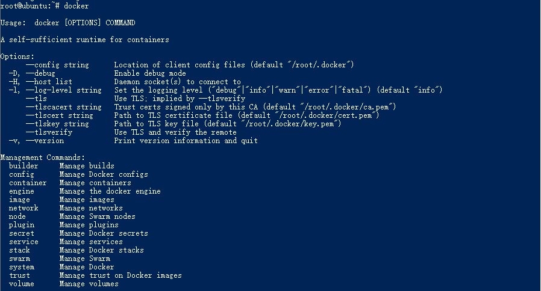
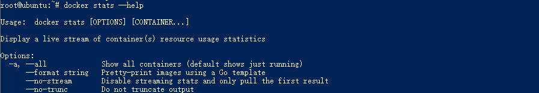
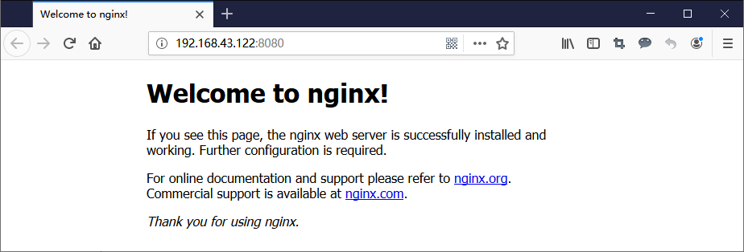

## Docker简介

Docker 是一个开源的应用容器引擎，基于Go语言并遵从Apache2.0协议开源。

Docker 可以让开发者打包他们的应用以及依赖包到一个轻量级、可移植的容器中，然后发布到任何流行的 Linux 机器上，也可以实现虚拟化。

容器是完全使用沙箱机制，相互之间不会有任何接口（类似 iPhone 的 app）,更重要的是容器性能开销极低。

## Ubuntu Docker 安装
### 1、Docker官方安装方法
Docker 要求 Ubuntu 系统的内核版本高于 3.10 ，查看本页面的前提条件来验证你的 Ubuntu 版本是否支持 Docker。

**获取安装包**：

```shell
root@ubuntu:~# wget -qO- https://get.docker.com/ | sh
```

**安装完成后有提示**：

```shell
    If you would like to use Docker as a non-root user, you should now consider
    adding your user to the "docker" group with something like:

    sudo usermod -aG docker runoob
   Remember that you will have to log out and back in for this to take effect!  
```

**启动docker服务**

```bash
root@ubuntu:~# sudo service docker start
```

### 2、通过安装URLOS获得

URLOS基于Docker运行，安装了URLOS，就等于安装了Docker，我们可以使用URLOS官方安装命令：

```bash
curl -LO www.urlos.com/iu && sh iu
```

或

```bash
curl -O https://www.urlos.com/install && chmod 544 install && ./install
```

##  Docker容器使用

### Docker客户端

Docker 客户端非常简单 ,可以直接输入 Docker 命令来查看到 Docker 客户端的所有命令选项。

```shell
root@ubuntu:~# docker
```



可以通过命令``docker command --help``更深入的了解指定的 Docker 命令使用方法。

例如我们要查看``docker stats``指令的具体使用方法：

```shell
root@ubuntu:~# docker stats --help
```



------

### 启动容器（交互模式）

我们如果要使用版本为16.04的ubuntu系统镜像来运行容器时，命令如下：

```
root@ubuntu:~# docker run -it ubuntu:16.04 sh
#
```

如果要使用版本为15.04的ubuntu系统镜像，则命令如下：

```
root@ubuntu:~# docker run -it ubuntu:15.04 sh
#
```

> 各个参数解析：
>
> - **docker:** Docker 的二进制执行文件。
> - **run:**与前面的 docker 组合来运行一个容器。
> - **-it:**其实是两个参数组成， -i 和 -t，**-i:**允许你对容器内的标准输入 (STDIN) 进行交互。**-t:**在新容器内指定一个伪终端或终端。
> - **ubuntu:15.04**:指定要运行的镜像，Docker首先从本地主机上查找镜像是否存在，如果不存在，Docker 就会从镜像仓库 Docker Hub 下载公共镜像。
> - **sh:**执行命令。

将上面的命令稍作修改，在结尾处加上一句命令，执行后：

```
root@ubuntu:~# docker run -it ubuntu:16.04 sh -c "while true; do echo hello urlos; sleep 1; done"
hello urlos
hello urlos
hello urlos
hello urlos
hello urlos
hello urlos
^Croot@ubuntu:~#
```

我们可以看到终端上不断输出 `hello urlos` ，这时按键盘`Ctrl+c`来终止输出。

### 启动容器（后台模式）

我们将上面的命令再稍作修改，把 `-it` 替换为 `-d` 看看结果：

```
root@ubuntu:~# docker run -d ubuntu:16.04 sh -c "while true; do echo hello urlos; sleep 1; done"
0cf141fd0745fb4dc104bec1a3238a1bd8dad7aa72926dea0a39ddc7ba54fe32
```

在输出中，我们没有看到期望的"hello world"，而是一串长字符

`0cf141fd0745fb4dc104bec1a3238a1bd8dad7aa72926dea0a39ddc7ba54fe32`

这个长字符串叫做容器ID，对每个容器来说都是唯一的，我们可以通过容器ID来查看对应的容器发生了什么。

首先，我们需要确认容器有在运行，可以通过 `docker ps` 来查看：

```
root@ubuntu:~# docker ps
CONTAINER ID        IMAGE               COMMAND                  CREATED             STATUS              PORTS                     NAMES
0cf141fd0745        ubuntu:16.04        "sh -c 'while true; …"   2 minutes ago       Up 2 minutes                                  hopeful_matsumoto
```

然后使用 `docker logs [ID或者名字]`命令，查看容器内的标准输出：

```
root@ubuntu:~# docker logs hopeful_matsumoto
hello urlos
hello urlos
hello urlos
hello urlos
hello urlos
hello urlos
hello urlos
hello urlos
```

我们可以看到，在容器内部已经输出了非常多的**hello urlos**，这说明容器处于后台运行模式。

------

### 运行一个WEB应用容器

现在我们将在docker容器中运行一个 nginx 应用来运行一个web应用。

首先从Docker Hub公共镜像源中拉取镜像：

```
root@ubuntu:~# docker pull nginx
```

然后运行这个镜像：

```
root@ubuntu:~# docker run -d -p 8080:80 nginx
```

> 参数说明:
>
> - **-d:**让容器在后台运行。
> - **-p:**让宿主机的8080端口映射给容器内部的80端口。

------

### 查看WEB应用容器

使用 `docker ps` 来查看我们正在运行的容器：

```
root@ubuntu:~# docker ps
CONTAINER ID        IMAGE               COMMAND             CREATED             STATUS              PORTS                     NAMES
b394756b6c5d        nginx               "nginx -g 'daemon of…"   3 seconds ago       Up 2 seconds        0.0.0.0:8080->80/tcp                elastic_babbage
```

我们看到端口信息 `0.0.0.0:8080->80/tcp`，意思是宿主机的8080端口映射给容器内部的80端口。

这时我们可以通过浏览器访问WEB应用：



------

### 查看端口的快捷方法

通过`docker ps`命令可以查看到容器的端口映射，docker还提供了另一个快捷方式 `docker port`，使用 `docker port` 可以查看指定 （ID 或者名字）容器的某个确定端口映射到宿主机的端口号。

上面我们创建的 web 应用容器 ID 为 **b394756b6c5d** 容器名为 **elastic_babbage**。

我可以使用 **docker port b394756b6c5d** 或 **docker port elastic_babbage** 来查看容器端口的映射情况。

```
root@ubuntu:~# docker port b394756b6c5d
80/tcp -> 0.0.0.0:8080
```

```
root@ubuntu:~# docker port affectionate_montalcini
80/tcp -> 0.0.0.0:8080
```

------

### 查看 WEB 应用程序日志

使用`docker logs [ID或者名字]` 可以查看容器内部的标准输出。

```
root@ubuntu:~# docker logs b394756b6c5d
192.168.43.131 - - [04/Jun/2019:06:28:42 +0000] "GET / HTTP/1.1" 200 612 "-" "Mozilla/5.0 (Windows NT 10.0; Win64; x64; rv:67.0) Gecko/20100101 Firefox/67.0" "-"
2019/06/05 06:28:42 [error] 6#6: *1 open() "/usr/share/nginx/html/favicon.ico" failed (2: No such file or directory), client: 192.168.43.131, server: localhost, request: "GET /favicon.ico HTTP/1.1", host: "192.168.43.122:8080"
192.168.43.131 - - [04/Jun/2019:06:28:42 +0000] "GET /favicon.ico HTTP/1.1" 404 153 "-" "Mozilla/5.0 (Windows NT 10.0; Win64; x64; rv:67.0) Gecko/20100101 Firefox/67.0" "-"
```

------

### 查看WEB应用程序容器的进程

我们还可以使用 `docker top` 来查看容器内部运行的进程

```
root@ubuntu:~# docker top b394756b6c5d
UID                 PID                 PPID                C                   STIME               TTY                 TIME                CMD
root                2069                2050                0                   23:24               ?                   00:00:00            nginx: master process nginx -g daemon off;
systemd+            2100                2069                0                   23:24               ?                   00:00:00            nginx: worker process
```

------

### 停止 WEB 应用容器

使用 `docker stop [ID或者名字]` 命令停止容器

```
root@ubuntu:~# docker stop b394756b6c5d
b394756b6c5d
```

### 启动 WEB 应用容器

使用 `docker start [ID或者名字]` 命令启动已经停止的容器

```
root@ubuntu:~# docker start b394756b6c5d
b394756b6c5d
```

###　重新启动WEB应用容器

我们能还可以使用 `docker restart [ID或者名字]` 命令重新启动正在运行的容器

```
root@ubuntu:~# docker restart b394756b6c5d
b394756b6c5d
```

`docker ps -l` 查询最后一次创建的容器：

```shell
root@ubuntu:~# docker ps -l
CONTAINER ID        IMAGE               COMMAND                  CREATED             STATUS              PORTS                  NAMES
b394756b6c5d        nginx               "nginx -g 'daemon of…"   12 minutes ago      Up 12 minutes       0.0.0.0:8080->80/tcp   elastic_babbage
```

------

### 删除WEB应用容器

我们可以使用 `docker rm [ID或者名字]` 命令来删除不需要的容器

注意：删除容器时，容器必须是停止状态，否则会报如下错误：

```shell
root@ubuntu:~# docker rm b394756b6c5d
Error response from daemon: You cannot remove a running container b394756b6c5d95f1d43f11393c169cc73de40938d8f09db81077c8bce6e5881a. Stop the container before attempting removal or force remove
```

如果要删除正在运行的容器，这时我们只需要加入 `-f` 参数即可：

```shell
root@ubuntu:~# docker rm -f b394756b6c5d
b394756b6c5d
```

