## 首先准备好固件
链接：[http://firmware.koolshare.cn/LEDE_X64_fw867/](http://firmware.koolshare.cn/LEDE_X64_fw867/)
链接是x64设备用的固件，有img格式和vmdk虚拟机专用的格式，这里选择虚拟机专用格式下载。

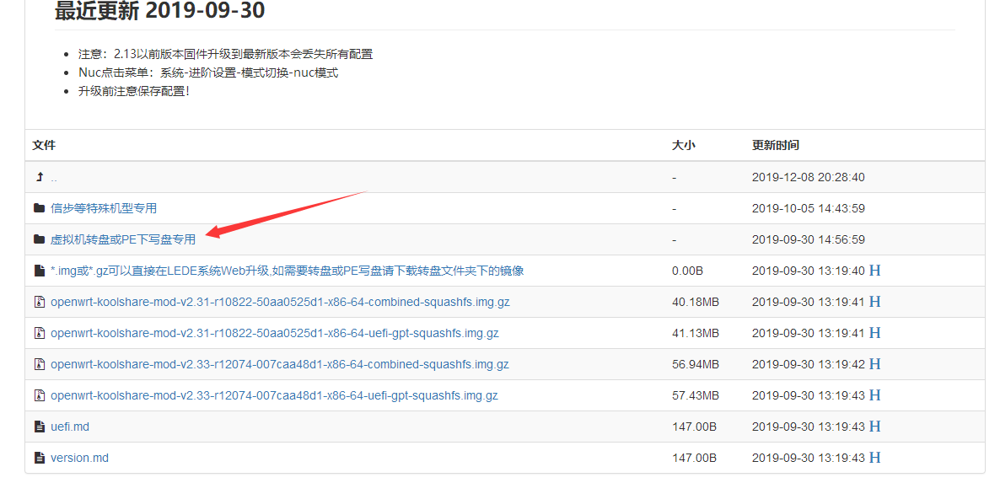

## 新建虚拟机
没啥好说的，看图跟着来吧

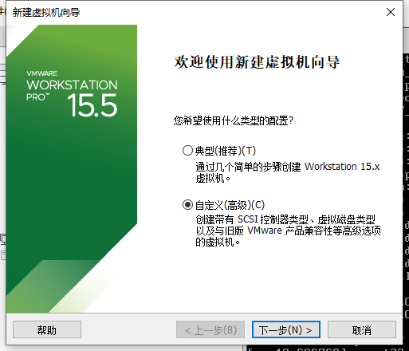

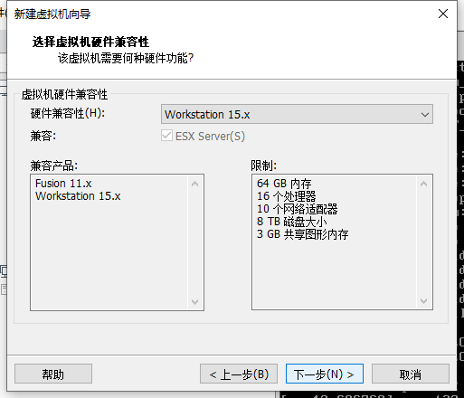

用老毛桃win10 PE
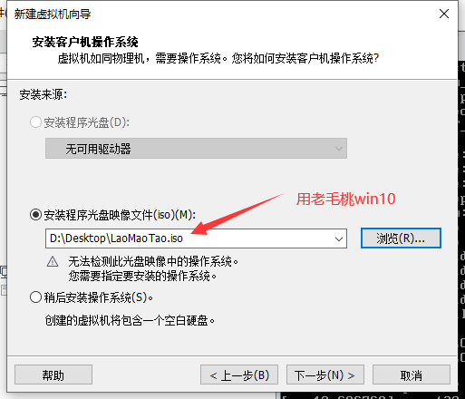

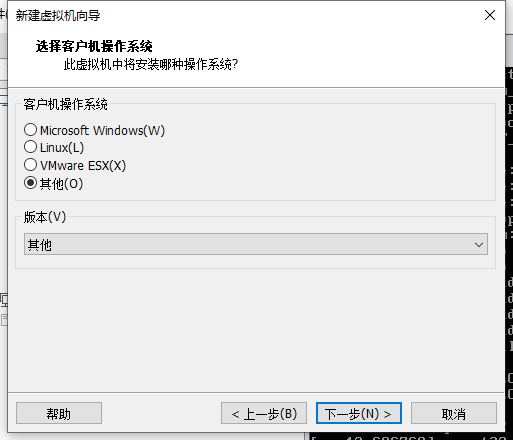

先给个2核，以后再降1核
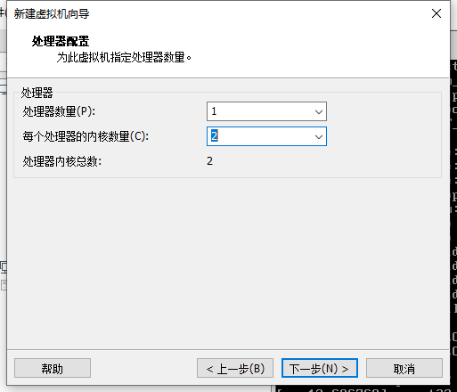

先给个2G，以后再降到256M都可以
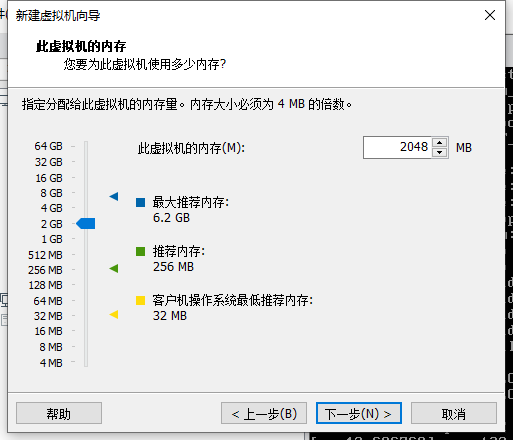

网络选择“仅主机”
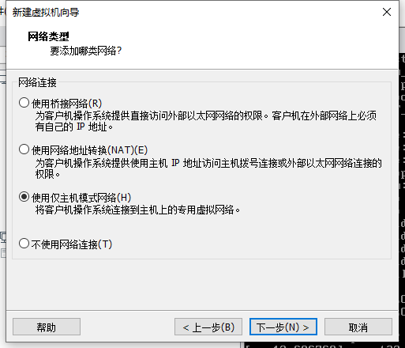

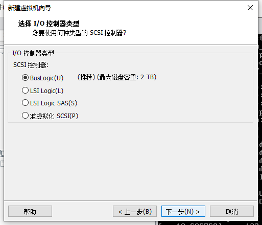

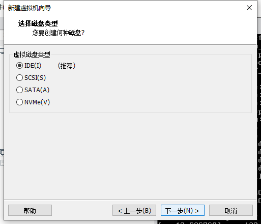

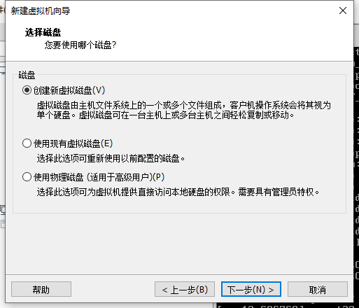

硬盘用不了多少几个G足够
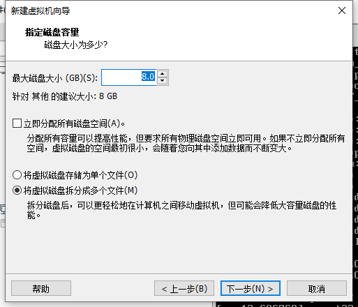

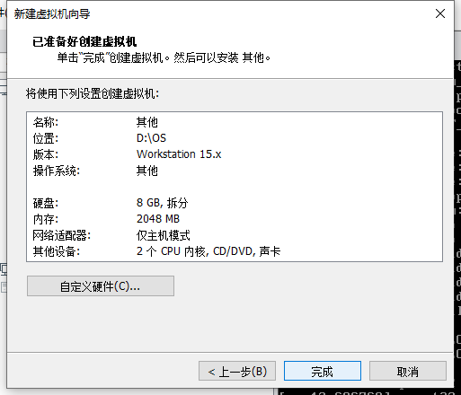

创建完成

## 把固件和IMG写盘工具烧录到一个iso镜像中

这样方便我们加载这两个文件

## 安装LEDE
启动虚拟机

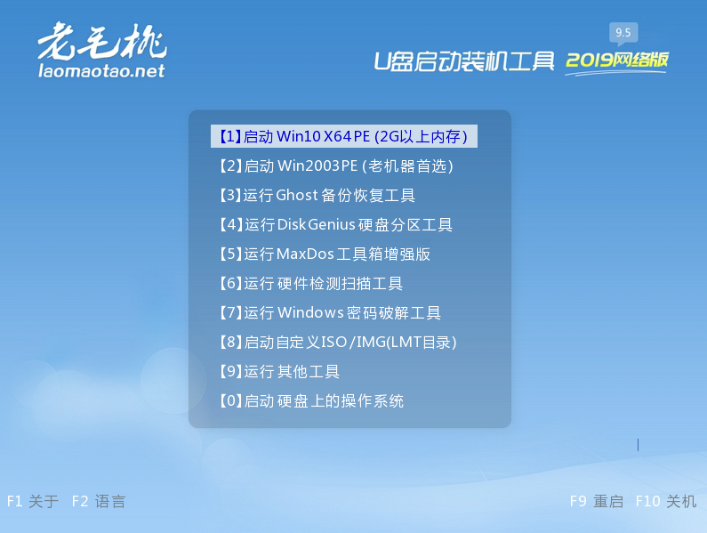

进入win10 PE系统后，把光驱的镜像换掉，换成上面我们烧录好的iso镜像
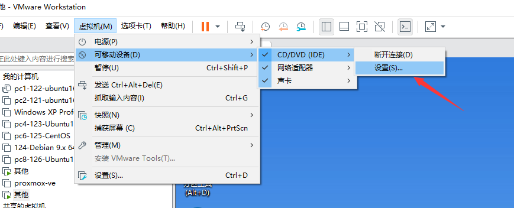

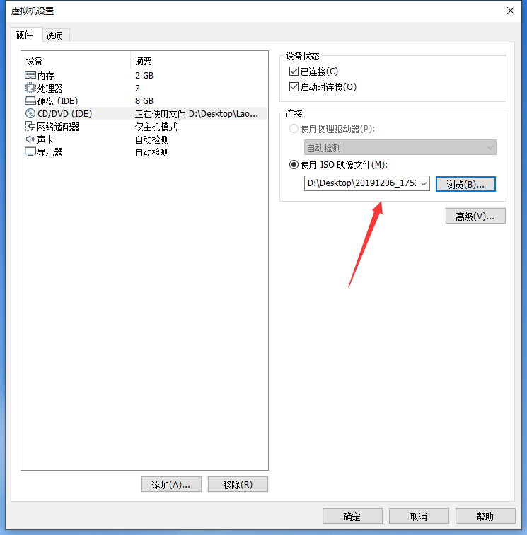

然后打开虚拟机PE系统中的“我的电脑”，打开光驱，运行IMG写盘工具

浏览加载固件文件
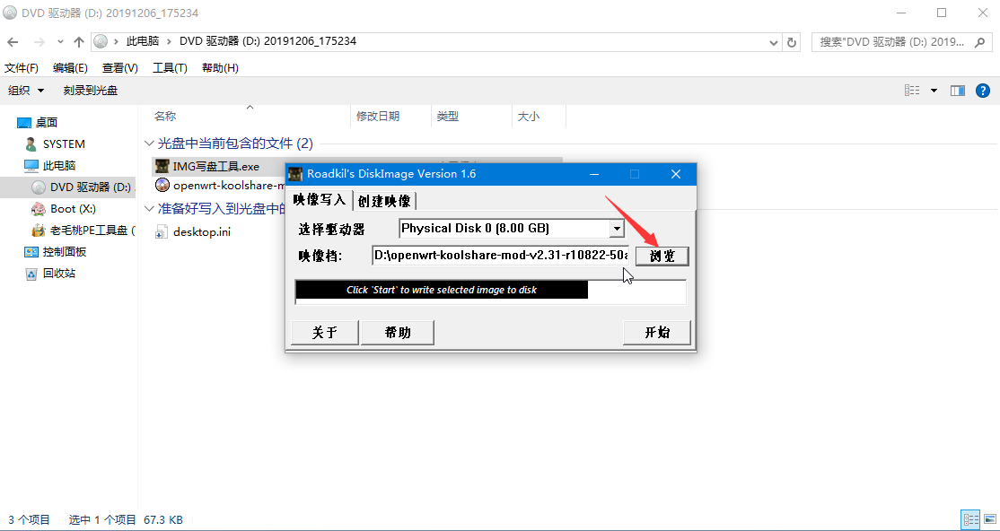
点开始即可，等待写盘完成，关闭虚拟机，将虚拟机内存降为256M，CPU降为1核，新增一个网卡，设置为桥接模式（个人验证，选择桥接模式适合母机通过op路由上网）

到这里，在VMware虚拟机中安装koolshare的openwrt/LEDE就完成了。