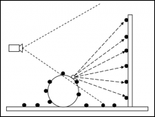
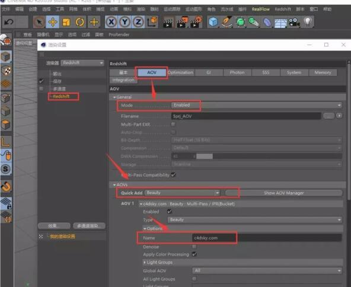

Redshift介绍
Redshift是世界上第一个完全基于GPU加速的，有偏差渲染器。
Redshift渲染场景比现有的基于CPU的渲染器要快许多倍，它能节省时间和金钱，并发挥你的创造力！

偏差渲染
Redshift是一种有偏差的渲染器，Redshift使用较少的样本数量运用近似和插值技术，
实现无噪点的渲染结果，使比无偏差渲染器快得多。

Redshift支持多种有偏差的全局光照技术,包括：
Brute Force GI
Photon Mapping (与 Caustics)
Irradiance Cache (类似于Irradiance Map 和 Final Gather)
Irradiance Point Cloud (类似于 Importons 和 Light Cache)
可以选择最适合您场景的技术

Out-of-Core心架构
Redshift采用了out-of-core架构的几何体和纹理，让您可以渲染大型场景，否则大场景将永远不能在显存中渲染一个GPU渲染共同问题是，它们受到显卡可用VRAM（显存）的限制——它们只能渲染储存在显存中的中的几何体和纹理。这对渲染数百万多边形和纹理以“G”为单位的大场景是一个问题。随着Redshift诞生，渲染数以千万计的多边形和几乎无限数量的纹理成为可能。

代理和实例
Redshift支持几何体实例让您实现大量草地和树林这种有大量重复物体的场景，高效的几乎没有内存消耗。
Redshift还支持渲染代理，可以从场景导出几何体，只有需要渲染时才会加载到内存中。使用代理，甚至不需要在三维软件载入场景文件。像普通几何体一样Redshift代理同样可以被实例化，可以渲染几十亿多边形数量。

<strong>2.6.41破解说明：</strong>

安装方法：
1.安装redshift_v2.6.41.exe,出现输入框时，输入yes安装
2.双击 “license.reg” 然后点 “是”, “确定”.
3.复制Crk替换补丁文件夹里面的文件到以下路径覆盖
C:\ProgramData\Redshift\bin
4.复制Crk文件夹里面的文件到以下路径覆盖
C4D R16-R19：X:\Program Files\MAXON\Cinema 4D\plugins\Redshift
C4D R20：C:\Program Files\MAXON\Cinema 4D R20\Plugins\Redshift\res\libs\win64
Maya/Houdini:”C:\Program Data\Redshift\Bin”
3DS Max:max根目录
5.运行软件Cinema 4D/3DsMax /Maya/Houdini软件, 弹窗出现 “name and password”, 输入提供的 “密码.txt”

说明：
请确保显卡驱动更新到最新，安装之前关闭各种杀毒卫士，管理员身份运行安装插件
C4D R16-R20各版本测试均无水印，破解正常，其他软件请自行测试

鉴于很人都遇到安装破解后，渲染水印问题，今天终于找到解决方法

<strong>敲黑板，划重点，记笔记！！！</strong>

1.在渲染设置，AOVS标签下的Quick Add,选择Beauty，Options下Name任意起一个名字，如173top.cn
2.然后在顶部菜单栏Redshift>Redshiftrender viewer,IPR里面选择刚才新建Beauty,这样渲染就没有水印了。

这个可以解决2.6.41版本多卡有水印，以及单卡有水印的问题。

<strong>RedShift (RS红移渲染器) for C4D v2.6.41去水印破解版下载：</strong>
链接: [https://pan.baidu.com/s/1Mkz91vdJiVnFzo1igIR3vg](https://pan.baidu.com/s/1Mkz91vdJiVnFzo1igIR3vg)
提取码: 32vs