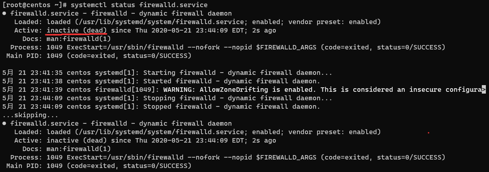

## 背景简介：

本地测试URLOS时，发现CentOS8的防火墙是默认开启状态，记录一下如何关闭CentOS8防火墙并禁止自动启动。

## 具体方法：

### 1. 首先查看防火墙状态

```bash
systemctl status firewalld.service
```


如上图显示：active（running），说明防火墙当前为开启状态。

### 2. 停止运行防火墙

```bash
systemctl stop firewalld.service
```

再次查看防火墙状态

```bash
systemctl status firewalld.service
```



如上图显示：inactive (dead)，说明防火墙当前为停止状态。

### 3. 禁止防火墙自启动

```bash
systemctl disable firewalld.service
```

----

## 那么，如何重新开启防火墙和自启动防火墙呢？

启动命令：

```bash
systemctl start firewalld.service
```

自启动命令：

````bash
systemctl enable firewalld.service
````

