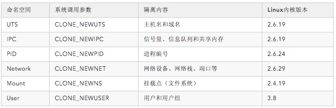
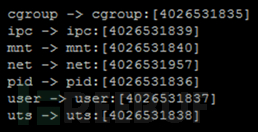
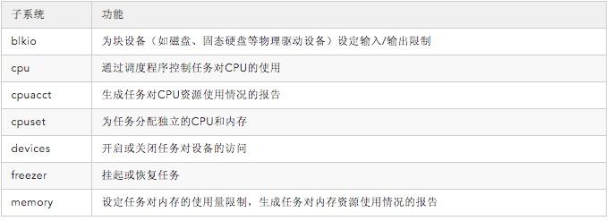
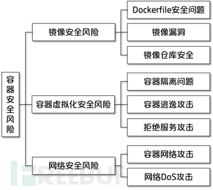
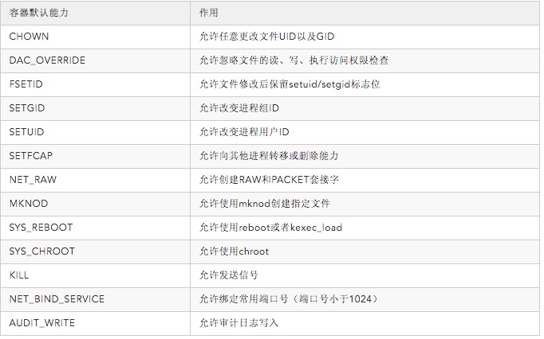
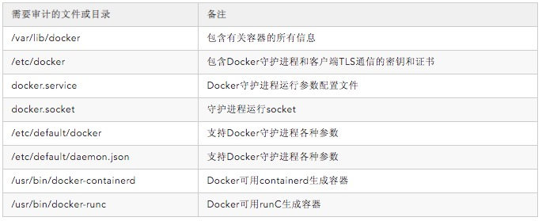

* toc
{:toc}
【编者的话】Docker是目前最具代表性的容器技术之一，对云计算及虚拟化技术产生了颠覆性的影响。本文对Docker容器在应用中可能面临的安全问题和风险进行了研究，并将Docker容器应用环境中的安全机制与相关解决方案分为容器虚拟化安全、容器安全管理、容器网络安全三部分进行分析。 

### 从虚拟化安全到容器安全

#### 传统虚拟化技术

虚拟化技术是实现硬件基础设施资源的充分利用、合理分配和有效调度的重要技术手段。例如，在基于OpenStack的典型IaaS服务中，云服务提供商可通过搭建设备集群建立资源池，并将服务器、存储和网络等底层资源进行弹性虚拟化提供给租户。

传统虚拟化技术以虚拟机为管理单元，各虚拟机拥有独立的操作系统内核，不共用宿主机的软件系统资源，因此具有良好的隔离性，适用于云计算环境中的多租户场景。

#### 容器技术

容器技术可以看作一种轻量级的虚拟化方式，将应用与必要的执行环境打包成容器镜像，使得应用程序可以直接在宿主机（物理机或虚拟机）中相对独立地运行。容器技术在操作系统层进行虚拟化，可在宿主机内核上运行多个虚拟化环境。相比于传统的应用测试与部署，容器的部署无需预先考虑应用的运行环境兼容性问题；相比于传统虚拟机，容器无需独立的操作系统内核就可在宿主机中运行，实现了更高的运行效率与资源利用率。

Docker是目前最具代表性的容器平台之一，它模糊了传统的IaaS和PaaS的边界，具有持续部署与测试、跨云平台支持等优点。在基于Kubernetes等容器编排工具实现的容器云环境中，通过对跨主机集群资源的调度，容器云可提供资源共享与隔离、容器编排与部署、应用支撑等功能。

Docker容器技术以宿主机中的容器为管理单元，但各容器共用宿主机内核资源，分别通过Linux系统的Namespaces和CGroups机制实现资源的隔离与限制。

**Namespaces**

为了保证容器进程之间的资源隔离，避免相互影响和干扰，Linux内核的Namespaces（命名空间）机制提供了UTS、User、Mount、Network、PID、IPC等命名空间实现了主机名、用户权限、文件系统、网络、进程号、进程间通信等六项资源隔离功能。通过调用clone()函数并传入相应的系统调用参数创建容器进程，可实现对应资源内容的隔离，具体情况如表1所示。

表1：Namespaces隔离机制

[](http://dockone.io/uploads/article/20200302/7b44a958d1d19937d17cb87324dd0134.png)


对于某个进程而言，可通过查看/proc/[PID]/ns文件，获取该进程下的命名空间隔离情况，如图1所示。其中，每一项命名空间都拥有一个编号对其进行唯一标识，如果宿主机中两个进程指向的命名空间编号相同，则表示他们同在一个命名空间之下。

[](http://dockone.io/uploads/article/20200302/f19c4d97ce546d2ba4b8cce476e4c261.png)


*图1：进程命名空间*

**CGroups**

CGroups（Control Groups，控制组）机制最早于2006年由Google提出，目前是Linux内核的一种机制，可以实现对任务组（进程组或线程组）使用的物理资源（CPU、内存、I/O等）进行限制和记录，通过多种度量标准为各个容器相对公平地分配资源，以防止资源滥用的情况。

在实际应用中，CGroups会为每个执行任务创建一个钩子，在任务执行的过程中涉及到资源分配使用时，就会触发钩子上的函数并对相应的资源进行检测，从而对资源进行限制和优先级分配。

CGroups提供了资源限制（Resource Limitation）、优先级分配（Prioritization）、资源统计（Accounting）、任务控制（Control）四个功能，包含blkio、cpu、cpuacct、cpuset、devices、freezer、memory、perf_event、net_cls、net_prio、ns、hugetlb等子系统，每种子系统独立地控制一种资源，可分别实现块设备输入/输出限制、CPU使用控制、生成CPU资源使用情况报告、内存使用量限制等功能。几个主要子系统的具体功能如表2所示。

表2：CGroups子系统

[](http://dockone.io/uploads/article/20200302/b639f51d8e67b4c54e8fce51e60f1223.png)


#### 安全性

传统虚拟化技术与Docker容器技术在运行时的安全性差异主要体现在隔离性方面，包括进程隔离、文件系统隔离、设备隔离、进程间通信隔离、网络隔离、资源限制等。

在Docker容器环境中，由于各容器共享操作系统内核，而容器仅为运行在宿主机上的若干进程，其安全性特别是隔离性与传统虚拟机相比在理论上与实际上都存在一定的差距。

### Docker容器安全风险分析

根据Docker容器的主要特点及其在安全应用中的实际问题，本文将Docker容器技术应用中可能存在的技术性安全风险分为镜像安全风险、容器虚拟化安全风险、网络安全风险等类型进行具体分析，如图2所示。

[](http://dockone.io/uploads/article/20200302/68d8a7494356d43a341f05c5e6a0bd0b.png)


*图2：容器安全风险分类*

#### 镜像安全风险

Docker镜像是Docker容器的静态表示形式，镜像的安全决定了容器的运行时安全。

Docker容器官方镜像仓库Docker Hub中的镜像可能由个人开发者上传，其数量丰富、版本多样，但质量参差不齐，甚至存在包含恶意漏洞的恶意镜像，因而可能存在较大的安全风险。具体而言，Docker镜像的安全风险分布在创建过程、获取来源、获取途径等方方面面。

**Dockerfile安全问题**

Docker镜像的生成主要包括两种方式，一种是对运行中的动态容器通过docker commit命令进行打包，另一种是通过docker build命令执行Dockerfile文件进行创建。为了确保最小安装原则，同时考虑容器的易维护性，一般推荐采用Dockerfile文件构建容器镜像，即在基础镜像上进行逐层应用添加操作。

Dockerfile是包含用于组合镜像命令的文本文件，一般由基础镜像信息（FROM）、维护者信息（MAINTAINER）、镜像操作指令（RUN、ADD、COPY等）、容器启动时执行指令（CMD等）四个部分组成，Docker可通过读取Dockerfile中的命令创建容器镜像。

Dockerfile文件内容在一定程度上决定了Docker镜像的安全性，其安全风险具体包括但不限于以下情况：

- 如果Dockerfile存在漏洞或被插入恶意脚本，那么生成的容器也可能产生漏洞或被恶意利用。例如，攻击者可构造特殊的Dockerfile压缩文件，在编译时触发漏洞获取执行任意代码的权限。
- 如果在Dockerfile中没有指定USER，Docker将默认以root用户的身份运行该Dockerfile创建的容器，如果该容器遭到攻击，那么宿主机的root访问权限也可能会被获取。
- 如果在Dockerfile文件中存储了固定密码等敏感信息并对外进行发布，则可能导致数据泄露的风险。
- 如果在Dockerfile的编写中添加了不必要的应用，如SSH、Telnet等，则会产生攻击面扩大的风险。


**镜像漏洞**

对于大多数一般的开发者而言，通常需要获取一系列基础镜像进行容器云的部署和进一步开发，因此，基础镜像的安全性在一定程度上决定了容器云环境的安全性。

镜像漏洞安全风险具体包括镜像中的软件含有CVE漏洞、攻击者上传含有恶意漏洞的镜像等情况。

1、CVE漏洞

由于镜像通常由基础操作系统与各类应用软件构成，因此，含有CVE漏洞的应用软件同样也会向Docker镜像中引入CVE漏洞。

镜像的获取通常是通过官方镜像仓库Docker Hub或网易、阿里云等提供的第三方镜像仓库。然而，根据对Docker Hub中镜像安全漏洞的相关研究，无论是社区镜像还是官方镜像，其平均漏洞数均接近200个，包括nginx、mysql、redis在内的常用镜像都含有高危漏洞。

2、恶意漏洞

恶意用户可能将含有后门、病毒等恶意漏洞的镜像上传至官方镜像库。2018年6月，安全厂商Fortinet和Kromtech在Docker Hub上发现17个包含用于数字货币挖矿恶意程序的Docker镜像，而这些恶意镜像当时已有500万次的下载量。目前，由于Docker应用在世界范围内具有广泛性，全网针对Docker容器的攻击很多都被用于进行数字货币挖矿，为攻击者带来实际经济利益，损害Docker用户的正常使用。

**镜像仓库安全**

作为搭建私有镜像存储仓库的工具，Docker Registry的应用安全性也必须得到保证。镜像仓库的安全风险主要包括仓库本身的安全风险和镜像拉取过程中的传输安全风险。

- 仓库自身安全：如果镜像仓库特别是私有镜像仓库被恶意攻击者所控制，那么其中所有镜像的安全性将无法得到保证。例如，如果私有镜像仓库由于配置不当而开启了2357端口，将会导致私有仓库暴露在公网中，攻击者可直接访问私有仓库并篡改镜像内容，造成仓库内镜像的安全隐患。
- 镜像拉取安全：如何保证容器镜像从镜像仓库到用户端的完整性也是镜像仓库面临的一个重要安全问题。由于用户以明文形式拉取镜像，如果用户在与镜像仓库交互的过程中遭遇了中间人攻击，导致拉取的镜像在传输过程中被篡改或被冒名发布恶意镜像，会造成镜像仓库和用户双方的安全风险。Docker已在其1.8版本后采用内容校验机制解决中间人攻击的问题。


#### 容器虚拟化安全风险

与传统虚拟机相比，Docker容器不拥有独立的资源配置，且没有做到操作系统内核层面的隔离，因此可能存在资源隔离不彻底与资源限制不到位所导致的安全风险。

**容器隔离问题**

对于Docker容器而言，由于容器与宿主机共享操作系统内核，因此存在容器与宿主机之间、容器与容器之间隔离方面的安全风险，具体包括进程隔离、文件系统隔离、进程间通信隔离等。

虽然Docker通过Namespaces进行了文件系统资源的基本隔离，但仍有/sys、/proc/sys、/proc/bus、/dev、time、syslog等重要系统文件目录和命名空间信息未实现隔离，而是与宿主机共享相关资源。

针对容器隔离安全风险问题，主要存在以下两种隔离失效的情况：

- 攻击者可能通过对宿主机内核进行攻击达到攻击其中某个容器的目的。
- 由于容器所在主机文件系统存在联合挂载的情况，恶意用户控制的容器也可能通过共同挂载的文件系统访问其他容器或宿主机，造成数据安全问题。


**容器逃逸攻击**

容器逃逸攻击指的是容器利用系统漏洞，“逃逸”出了其自身所拥有的权限，实现了对宿主机和宿主机上其他容器的访问。由于容器与宿主机共享操作系统内核，为了避免容器获取宿主机的root权限，通常不允许采用特权模式运行Docker容器。

在容器逃逸案例中，最为著名的是shocker.c程序，其通过调用open_by_handle_at函数对宿主机文件系统进行暴力扫描，以获取宿主机的目标文件内容。由于Docker 1.0之前版本对容器能力（Capability）使用黑名单策略进行管理，并没有限制CAP_DAC_READ_SEARCH能力，赋予了shocker.c程序调用open_by_handle_at函数的能力，导致容器逃逸的发生。因此，对容器能力的限制不当是可能造成容器逃逸等安全问题的风险成因之一。所幸的是，Docker在后续版本中对容器能力采用白名单管理，避免了默认创建的容器通过shocker.c案例实现容器逃逸的情况。

此外，在Black Hat USA 2019会议中，来自Capsule8的研究员也给出了若干Docker容器引擎漏洞与容器逃逸攻击方法，包括CVE-2019-5736、CVE-2018-18955、CVE-2016-5195等可能造成容器逃逸的漏洞。

- CVE-2019-5736是runC的一个安全漏洞，导致18.09.2版本前的Docker允许恶意容器覆盖宿主机上的runC二进制文件。runC是用于创建和运行Docker容器的CLI工具，该漏洞使攻击者能够以root身份在宿主机上执行任意命令。
- CVE-2018-18955漏洞涉及到User命名空间中的嵌套用户命名空间，用户命名空间中针对uid（用户ID）和gid（用户组ID）的ID映射机制保证了进程拥有的权限不会逾越其父命名空间的范畴。该漏洞利用创建用户命名空间的子命名空间时损坏的ID映射实现提权。
- CVE-2016-5195脏牛（Dirty CoW）Linux内核提权漏洞可以使低权限用户在多版本Linux系统上实现本地提权，进而可能导致容器逃逸的发生。Linux内核函数get_user_page在处理Copy-on-Write时可能产生竞态条件，导致出现向进程地址空间内只读内存区域写数据的机会，攻击者可进一步修改su或者passwd程序以获取root权限。


**拒绝服务攻击**

由于容器与宿主机共享CPU、内存、磁盘空间等硬件资源，且Docker本身对容器使用的资源并没有默认限制，如果单个容器耗尽宿主机的计算资源或存储资源（例如进程数量、存储空间等）可能导致宿主机或其他容器的拒绝服务。

1、计算型DoS攻击

Fork Bomb是一类典型的针对计算资源的拒绝服务攻击手段，其可通过递归方式无限循环调用fork()系统函数快速创建大量进程。由于宿主机操作系统内核支持的进程总数有限，如果某个容器遭到了Fork Bomb攻击，那么就有可能存在由于短时间内在该容器内创建过多进程而耗尽宿主机进程资源的情况，宿主机及其他容器就无法再创建新的进程。

2、存储型DoS攻击

针对存储资源，虽然Docker通过Mount命名空间实现了文件系统的隔离，但CGroups并没有针对AUFS文件系统进行单个容器的存储资源限制，因此采用AUFS作为存储驱动具有一定的安全风险。如果宿主机上的某个容器向AUFS文件系统中不断地进行写文件操作，则可能会导致宿主机存储设备空间不足，无法再满足其自身及其他容器的数据存储需求。

#### 网络安全风险

网络安全风险是互联网中所有信息系统所面临的重要风险，不论是物理设备还是虚拟机，都存在难以完全规避的网络安全风险问题。而在轻量级虚拟化的容器网络环境中，其网络安全风险较传统网络而言更为复杂严峻。

**容器网络攻击**

Docker提供桥接网络、MacVLAN、覆盖网络（Overlay）等多种组网模式，可分别实现同一宿主机内容器互联、跨宿主机容器互联、容器集群网络等功能。

1、网桥模式

Docker默认采用网桥模式，利用iptables进行NAT转换和端口映射。Docker将所有容器都通过虚拟网络接口对连接在一个名为docker0的虚拟网桥上，作为容器的默认网关，而该网桥与宿主机直接相连。

容器内部的数据包经过虚拟网络接口对到达docker0，实现同一子网内不同容器间的通信。在网桥模式下，同一宿主机内各容器间可以互相通信，而宿主机外部无法通过分配给容器的IP地址对容器进行外部访问。

由于缺乏容器间的网络安全管理机制，无法对同一宿主机内各容器之间的网络访问权限进行限制。具体而言，由于各容器之间通过宿主机内部网络的docker0网桥连接以实现路由和NAT转换，如果容器间没有防火墙等保护机制，则攻击者可通过某个容器对宿主机内的其他容器进行ARP欺骗、嗅探、广播风暴等攻击，导致信息泄露、影响网络正常运行等安全后果。

因此，如果在同一台宿主机上部署的多个容器没有进行合理的网络配置进行访问控制边界隔离，将可能产生容器间的网络安全风险。

2、MacVLAN

MacVLAN是一种轻量级网络虚拟化技术，通过与主机的网络接口连接实现了与实体网络的隔离性。

MacVLAN允许为同一个物理网卡配置多个拥有独立MAC地址的网络接口并可分别配置IP地址，实现了网卡的虚拟化。MacVLAN模式无需创建网桥，即无需NAT转换和端口映射就可以直接通过网络接口连接到物理网络，不同MacVLAN网络间不能在二层网络上进行通信。

然而，处于同一虚拟网络下各容器间同样没有进行访问权限控制，因此MacVLAN模式依然存在与网桥模式类似的内部网络攻击的安全风险。

3、Overlay网络

Overlay网络架构主要用于构建分布式容器集群，通过VxLAN技术在不同主机之间的Underlay网络上建立虚拟网络，以搭建跨主机容器集群，实现不同物理主机中同一Overlay网络下的容器间通信。

与其他组网模式一样，Overlay网络也没有对同一网络内各容器间的连接进行访问控制。此外，由于VxLAN网络流量没有加密，需要在设定IPSec隧道参数时选择加密以保证容器网络传输内容安全。

因此，无论采用何种网络连接模式，都难以避免容器间互相攻击的安全风险。

**网络DoS攻击**

由于网络虚拟化的存在，容器网络面临着与传统网络不同的DoS攻击安全风险。Docker容器网络的DoS攻击分为内部威胁和外部威胁两种主要形式。

- 内部威胁：针对Docker容器网络环境，DoS攻击可不通过物理网卡而在宿主机内部的容器之间进行，攻击者通过某个容器向其他容器发起DoS攻击可能降低其他容器的网络数据处理能力。因此，存在容器虚拟网络间的DoS攻击风险。
- 外部威胁：由于同一台宿主机上的所有容器共享宿主机的物理网卡资源，若外部攻击者使用包含大量受控主机的僵尸网络向某一个目标容器发送大量数据包进行DDoS攻击，将可能占满宿主机的网络带宽资源，造成宿主机和其他容器的拒绝服务。


### Docker容器安全机制与解决方案

#### 容器虚拟化安全

在传统虚拟化技术架构中，Hypervisor虚拟机监视器是虚拟机资源的管理与调度模块。而在容器架构中，由于不含有Hypervisor层，因此需要依靠操作系统内核层面的相关机制对容器进行安全的资源管理。

**容器资源隔离与限制**

在资源隔离方面，与采用虚拟化技术实现操作系统内核级隔离不同，Docker通过Linux内核的Namespace机制实现容器与宿主机之间、容器与容器之间资源的相对独立。通过为各运行容器创建自己的命名空间，保证了容器中进程的运行不会影响到其他容器或宿主机中的进程。

在资源限制方面，Docker通过CGroups实现宿主机中不同容器的资源限制与审计，包括对CPU、内存、I/O等物理资源进行均衡化配置，防止单个容器耗尽所有资源造成其他容器或宿主机的拒绝服务，保证所有容器的正常运行。

但是，CGroups未实现对磁盘存储资源的限制。若宿主机中的某个容器耗尽了宿主机的所有存储空间，那么宿主机中的其他容器无法再进行数据写入。Docker提供的–storage-opt=[]磁盘限额仅支持Device Mapper文件系统，而Linux系统本身采用的磁盘限额机制是基于用户和文件系统的quota技术，难以针对Docker容器实现基于进程或目录的磁盘限额。因此，可考虑采用以下方法实现容器的磁盘存储限制：

- 为每个容器创建单独用户，限制每个用户的磁盘使用量；
- 选择XFS等支持针对目录进行磁盘使用量限制的文件系统；
- 为每个容器创建单独的虚拟文件系统，具体步骤为创建固定大小的磁盘文件，并从该磁盘文件创建虚拟文件系统，然后将该虚拟文件系统挂载到指定的容器目录。


此外，在默认情况下，容器可以使用主机上的所有内存。可以使用内存限制机制来防止一个容器消耗所有主机资源的拒绝服务攻击，具体可使用使用-m或-memory参数运行容器。

```
（命令示例：docker run [运行参数] -memory [内存大小] [容器镜像名或ID] [命令]）
```


**容器能力限制**

Linux内核能力表示进程所拥有的系统调用权限，决定了程序的系统调用能力。

容器的默认能力包括CHOWN、DAC_OVERRIDE、FSETID、SETGID、SETUID、SETFCAP、NET_RAW、MKNOD、SYS_REBOOT、SYS_CHROOT、KILL、NET_BIND_SERVICE、AUDIT_WRITE等等，具体功能如表3所示。

表3：容器默认能力

[](http://dockone.io/uploads/article/20200302/967d82d38b79aacbe2664ce5fb811dbf.png)


如果对容器能力不加以适当限制，可能会存在以下安全隐患：

- 内部因素：在运行Docker容器时，如果采用默认的内核功能配置可能会产生容器的隔离问题。
- 外部因素：不必要的内核功能可能导致攻击者通过容器实现对宿主机内核的攻击。


因此，不当的容器能力配置可能会扩大攻击面，增加容器与宿主机面临的安全风险，在执行docker run命令运行Docker容器时可根据实际需求通过–cap-add或–cap-drop配置接口对容器的能力进行增删。

```
（命令示例：docker run --cap-drop ALL --cap-add SYS_TIME ntpd /bin/sh）
```


**强制访问控制**

强制访问控制（Mandatory Access Control，MAC）是指每一个主体（包括用户和程序）和客体都拥有固定的安全标记，主体能否对客体进行相关操作，取决于主体和客体所拥有安全标记的关系。在Docker容器应用环境下，可通过强制访问控制机制限制容器的访问资源。Linux内核的强制访问控制机制包括SELinux、AppArmor等。

1、SELinux机制

SELinux（Security-Enhanced Linux）是Linux内核的强制访问控制实现，由美国国家安全局（NSA）发起，用以限制进程的资源访问，即进程仅能访问其任务所需的文件资源。因此，可通过SELinux对Docker容器的资源访问进行控制。

在启动Docker daemon守护进程时，可通过将–selinux-enabled参数设为true，从而在Docker容器中使用SELinux。SELinux可以使经典的shocker.c程序失效，使其无法逃逸出Docker容器实现对宿主机资源的访问。

```
（命令示例：docker daemon --selinux-enabled = true）
```


2、AppArmor机制

与SELinux类似，AppArmor（Application Armor，应用程序防护）也是Linux的一种强制访问控制机制，其作用是对可执行程序进行目录和文件读写、网络端口访问和读写等权限的控制。

在Docker daemon启动后会在/etc/apparmor.d/docker自动创建AppArmor的默认配置文件docker-default，可通过在该默认配置文件中新增访问控制规则的方式对容器进行权限控制，同时可在启动容器时通过–security-opt指定其他配置文件。例如，在配置文件中加入一行deny /etc/hosts rwklx限制对/etc/hosts的获取，同样可使shocker.c容器逃逸攻击失效。

```
（命令示例：docker run --rm -ti --cap-add=all --security-opt apparmor:docker-default shocker bash）
```


**Seccomp机制**

Seccomp（Secure Computing Mode）是Linux内核提供的安全特性，可实现应用程序的沙盒机制构建，以白名单或黑名单的方式限制进程能够进行的系统调用范围。

在Docker中，可通过为每个容器编写json格式的seccomp profile实现对容器中进程系统调用的限制。在seccomp profile中，可定义以下行为对进程的系统调用做出响应：

- SCMP_ACT_KILL：当进程进行对应的系统调用时，内核发出SIGSYS信号终止该进程，该进程不会接受到这个信号；
- SCMP_ACT_TRAP：当进程进行对应的系统调用时，该进程会接收到SIGSYS信号，并改变自身行为；
- SCMP_ACT_ERRNO：当进程进行对应的系统调用时，系统调用失败，进程会接收到errno返回值；
- SCMP_ACT_TRACE：当进程进行对应的系统调用时，进程会被跟踪；
- SCMP_ACT_ALLOW：允许进程进行对应的系统调用行为。


默认情况下，在Docker容器的启动过程中会使用默认的seccomp profile，可使用security-opt seccomp选项使用特定的seccomp profile。

```
（命令示例：docker run --rm -it --security-opt seccomp:/path/to/seccomp/profile.json hello-world）
```


#### 容器安全管理

**镜像仓库安全**

1、内容信任机制

Docker的内容信任（Content Trust）机制可保护镜像在镜像仓库与用户之间传输过程中的完整性。目前，Docker的内容信任机制默认关闭，需要手动开启。内容信任机制启用后，镜像发布者可对镜像进行签名，而镜像使用者可以对镜像签名进行验证。

具体而言，镜像构建者在通过docker build命令运行Dockerfile文件前，需要通过手动或脚本方式将DOCKER_CONTENT_TRUST环境变量置为1进行启用。在内容信任机制开启后，push、build、create、pull、run等命令均与内容信任机制绑定，只有通过内容信任验证的镜像才可成功运行这些操作。例如，Dockerfile中如果包含未签名的基础镜像，将无法成功通过docker build进行镜像构建。

```
（命令示例：export DOCKER_CONTENT_TRUST = 1）
```


2、Notary项目

Notary是一个从Docker中剥离的独立开源项目，提供数据收集的安全性。Notary用于发布内容的安全管理，可对发布的内容进行数字签名，并允许用户验证内容的完整性和来源。Notary的目标是保证服务器与客户端之间使用可信连接进行交互，用于解决互联网内容发布的安全性，并未局限于容器应用。

在Docker容器场景中，Notary可支持Docker内容信任机制。因此，可使用Notary构建镜像仓库服务器，实现对容器镜像的签名，对镜像源认证、镜像完整性等安全需求提供更好的支持。

**镜像安全扫描**

为了保证容器运行的安全性，在从公共镜像仓库获取镜像时需要对镜像进行安全检查，防止存在安全隐患甚至恶意漏洞的镜像运行，从源头端预防安全事故的发生。镜像漏洞扫描工具是一类常用的镜像安全检查辅助工具，可检测出容器镜像中含有的CVE漏洞。

针对Docker镜像的漏洞扫描，目前已经有许多相关工具与解决方案，包括Docker Security Scanning、Clair、Anchore、Trivy、Aqua等等。

1、Docker Security Scanning服务

Docker Security Scanning是Docker官方推出的不开源镜像漏洞扫描服务，用于检测Docker Cloud服务中私有仓库和Docker Hub官方仓库中的镜像是否安全。

Docker Security Scanning包括扫描触发、扫描器、数据库、附加元件框架以及CVE漏洞数据库比对等服务。当仓库中有镜像发生更新时，会自动启动漏洞扫描；当CVE漏洞数据库发生更新时，也会实时更新镜像漏洞扫描结果。

2、Clair工具

Clair是一款开源的Docker镜像漏洞扫描工具。与Docker Security Scanning类似，Clair通过对Docker镜像进行静态分析并与公共漏洞数据库关联，得到相应的漏洞分析结果。Clair主要包括以下模块：

- Fetcher（获取器）：从公共的CVE漏洞源收集漏洞数据；
- Detector（检测器）：对镜像的每一个Layer进行扫描，提取镜像特征；
- Notifier（通知器）：用于接收WebHook从公开CVE漏洞库中的最新漏洞信息并进行漏洞库更新；
- Databases（数据库）：PostSQL数据库存储容器中的各个层和CVE漏洞；


3、Trivy工具

Trivy是一个简单而全面的开源容器漏洞扫描程序。Trivy可检测操作系统软件包（Alpine、RHEL、CentOS等）和应用程序依赖项（Bundler、Composer、npm、yarn等）的漏洞。此外，Trivy具有较高的易用性，只需安装二进制文件并指定扫描容器的镜像名称即可执行扫描。Trivy提供了丰富的功能接口，相比于其他容器镜像漏洞扫描工具更适合自动化操作，可更好地满足持续集成的需求。

```
（命令示例：trivy [镜像名]）
```


**容器运行时监控**

为了在系统运维层面保证容器运行的安全性，实现安全风险的即时告警与应急响应，需要对Docker容器运行时的各项性能指标进行实时监控。

针对Docker容器监控的工具与解决方案包括docker stats、cAdvisor、Scout、DataDog、Sensu等等，其中最常见的是Docker原生的docker stats命令和Google的cAdvisor开源工具。

1、docker stats命令

docker stats是Docker自带的容器资源使用统计命令，可用于对宿主机上的Docker容器的资源使用情况进行手动监控，具体内容包括容器的基本信息、容器的CPU使用率、内存使用率、内存使用量与限制、块设备I/O使用量、网络I/O使用量、进程数等信息。用户可根据自身需求设置–format参数控制docker stats 命令输出的内容格式。

```
（命令示例：docker stats [容器名]）
```


2、cAdvisor工具

由于docker stats只是简单的容器资源查看命令，其可视化程度不高，同时不支持监控数据的存储。cAdvisor是由Google开源的容器监控工具，优化了docker stats在可视化展示与数据存储方面的缺陷。

cAdvisor在宿主机上以容器方式运行，通过挂载在本地卷，可对同一台宿主机上运行的所有容器进行实时监控和性能数据采集，具体包括CPU使用情况、内存使用情况、网络吞吐量、文件系统使用情况等信息，并提供本地基础查询界面和API接口，方便与其他第三方工具进行搭配使用。cAdvisor默认将数据缓存在内存中，同时也提供不同的持久化存储后端支持，可将监控数据保存Google BigQuery、InfluxDB或Redis等数据库中。

cAdvisor基于Go语言开发，利用CGroups获取容器的资源使用信息，目前已被集成在Kubernetes中的Kubelet组件里作为默认启动项。

```
（命令示例：docker run -v /var/run:/var/run:rw -v/sys:/sys:ro -v/var/lib/docker:/var/lib/docker:ro -p8080:8080 -d --name cadvisor google/cadvisor）
```


**容器安全审计**

1、Docker守护进程审计

在安全审计方面，对于运行Docker容器的宿主机而言，除需对主机Linux文件系统等进行审计外，还需对Docker守护进程的活动进行审计。由于系统默认不会对Docker守护进程进行审计，需要通过主动添加审计规则或修改规则文件进行。

```
（命令示例：auditctl -w /usr/bin/docker -k docker或修改/etc/audit/audit.rules文件）
```


2、Docker相关文件目录审计

除Docker守护进程之外，还需对与Docker的运行相关的文件和目录进行审计，同样需要通过命令行添加审计规则或修改规则配置文件，具体文件和目录如表4所示。

表4：Docker相关文件和目录审计

[](http://dockone.io/uploads/article/20200302/aa98958bd374d24fc799d01e63febdd2.png)


Docker公司与美国互联网安全中心（CIS）联合制定了Docker最佳安全实践CIS Docker Benchmark，目前最新版本为1.2.0。为了帮助Docker用户对其部署的容器环境进行安全检查，Docker官方提供了Docker Bench for Security安全配置检查脚本工具docker-bench-security，其检查依据便是CIS制定的Docker最佳安全实践。

#### 容器网络安全

**容器间流量限制**

由于Docker容器默认的网桥模式不会对网络流量进行控制和限制，为了防止潜在的网络DoS攻击风险，需要根据实际需求对网络流量进行相应的配置。

1、完全禁止容器间通信

在特定的应用场景中，如果宿主机中的所有容器无需在三层或四层进行网络通信交互，可通过将Docker daemon的–icc参数设为false以禁止容器与容器间的通信。

```
（命令示例：dockerd --icc = false）
```


2、容器间流量控制

在存在多租户的容器云环境中，可能存在单个容器占用大量宿主机物理网卡抢占其他容器带宽的情况。为了保证容器之间的正常通信，同时避免异常流量造成网络DoS攻击等后果，需要对容器之间的通信流量进行一定的限制。

由于Docker通过创建虚拟网卡对（eth0和veth* ）将容器与虚拟网桥docker0连接，而容器之间的通信需要经由虚拟网卡对eth0和veth* 通过网桥连接，因此，可采用Linux的流量控制模块traffic controller对容器网络进行流量限制。

traffic controller的原理是建立数据包队列并制定发送规则，实现流量限制与调度的功能。为了在一定程度上减轻容器间的DoS攻击的危害，可将traffic controller的dev设置为宿主机中与各容器连接的veth*虚拟网卡，以此进行宿主机上容器间流量限制。

**网桥模式下的网络访问控制**

在默认的网桥连接模式中，连接在同一个网桥的两个容器可以进行直接相互访问。因此，为了实现网络访问控制，可按需配置网络访问控制机制和策略。

1、为容器创建不同的桥接网络

为了实现容器间的网络隔离，可将容器放在不同的桥接网络中。当在Docker中使用docker network create命令创建新的桥接网络时，会在iptables中的DOCKER-ISOLATION新增DROP丢弃规则，阻断与其他网络之间的通信流量，实现容器网络之间隔离的目的。

```
（命令示例：docker network create --subnet 102.102.0.0/24 test）
```


2、基于白名单策略的网络访问控制

为了保证容器间的网络安全，可默认禁止容器间的通信，然后按需设置网络访问控制规则。

具体而言，在同一虚拟网络内，不同Docker容器之间的网络访问可通过iptables进行控制。在将Docker daemon的–icc参数设为false后，iptables的FORWARD链策略为默认全部丢弃。此时，可采用白名单策略实现网络访问控制，即根据实际需要在iptables中添加访问控制策略，以最小化策略减小攻击面。

**集群模式下的网络访问控制**

与通过OpenStack建立的虚拟化集群通过VLAN对不同租户进行子网隔离不同，基于Overlay网络的容器集群在同一主机内相同子网中的不同容器之间默认可以直接访问。

如需控制宿主机外部到内部容器应用的访问，可通过在宿主机iptables中的DOCKER-INGRESS链手动添加ACL访问控制规则以控制宿主机的eth0到容器的访问，或者在宿主机外部部署防火墙等方法实现。

然而，在大型的容器云环境中，由于存在频繁的微服务动态变化更新，通过手动的方式配置iptables或更新防火墙是不现实的。因此，可通过微分段（Micro-Segmentation）实现面向容器云环境中的容器防火墙。微分段是一种细粒度的网络分段隔离机制，与传统的以网络地址为基本单位的网络分段机制不同，微分段可以以单个容器、同网段容器、容器应用为粒度实现分段隔离，并通过容器防火墙对实现微分段间的网络访问控制。

### 总结

与虚拟化技术相比，Docker容器技术具有敏捷化、轻量化等特点，在推进云原生应用方面具有不可替代性。与此同时，容器技术对于高效性的追求也牺牲了隔离性等安全要求，在安全性方面与虚拟化技术相比还存在较大差距，且所涉及的面较广，涉及到容器的镜像安全、内核安全、网络安全、虚拟化安全、运行时安全等各个层面。

在应用容器技术进行系统部署时，应充分评估安全风险，根据应用场景制定相应安全需求，并整合相关安全解决方案，形成容器安全应用最佳实践。