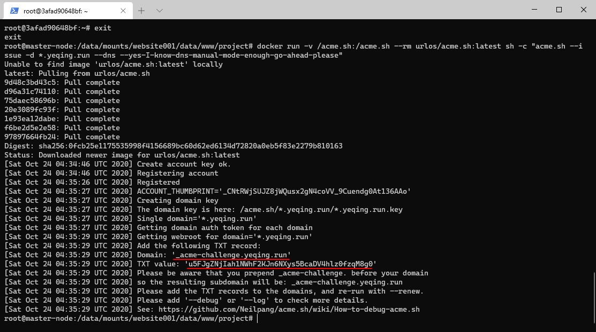

使用该方法需要docker环境

## 1、生成TXT记录值

首先，使用如下命令生成域名的TXT记录（请根据“Domain”和“TXT value”那两行的内容填写域名的TXT记录）

```bash
docker run -v /acme.sh:/acme.sh --rm yeqing112/acme.sh:latest sh -c "acme.sh --issue -d *.yeqing.run --dns --yes-I-know-dns-manual-mode-enough-go-ahead-please"
```

命令执行后，等待一会儿，然后会返回如下信息，意思是我们需要将域名新增一个TXT解析记录，在主机记录和记录值填上相应内容：



域名TXT记录添加完成后，再执行以下命令生成域名证书：

```bash
docker run -v /acme.sh:/acme.sh --rm yeqing112/acme.sh:latest sh -c "acme.sh --renew -d *.yeqing.run --yes-I-know-dns-manual-mode-enough-go-ahead-please"
```

如无意外，泛域名SSL证书生成成功，fullchain.cer是泛域名的公钥，*.yeqing.run.key是泛域名的私钥。