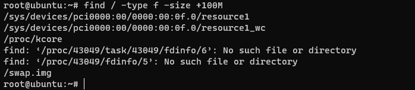

下面整理了一些在Linux系统中查找大文件或文件夹的方法

## 查找大文件

使用命令：

```bash
find / -type f -size +800M
```

> 查找大于800M的文件



如上命令所示，我们仅仅能看到超过800M大小的文件的文件名称，但是对文件的信息（例如，文件大小、文件属性）一无所知，那么能否更详细显示一些文件属性或信息呢，当然可以，使用命令：

```bsah
find / -type f -size +800M  -print0 | xargs -0 ls -l
```

当我们只需要查找超过800M大小文件，并显示查找出来文件的具体大小，可以使用命令：

```bash
find / -type f -size +800M  -print0 | xargs -0 du -h
```

如果你还需要对查找结果按照文件大小做一个排序，那么可以使用命令：

```bash
find / -type f -size +800M  -print0 | xargs -0 du -h | sort -nr
```

##  查找打目录

使用命令：

```bash
du -h --max-depth=1
```

如果想知道flash_recovery_area目录下面有哪些大文件夹，那么可以将参数max-depth=2 ，如果想对搜索出来的结果进行排序，那么可以借助于sort命令。如下所示:

```bash
du -h --max-depth=2 | sort -n
```

有时候搜索出来的结果太多了（譬如，从根目录开始搜索），一直在刷屏，如果只想查出最大的12个文件夹，怎么办呢？此时就要借助head命令来显示了

```bahs
du -hm --max-depth=2 | sort -nr | head -12
```

