## 一、软骨鱼SaaS平台介绍

### 1.1 平台概述

软骨鱼SaaS平台是一个操作简单，便于维护的低成本软件服务运营平台，它让传统软件在不进行多租户改造的情况下实现SaaS模式运营，让您更专注于软件的业务流程与模式的创新。

### 1.2 技术架构

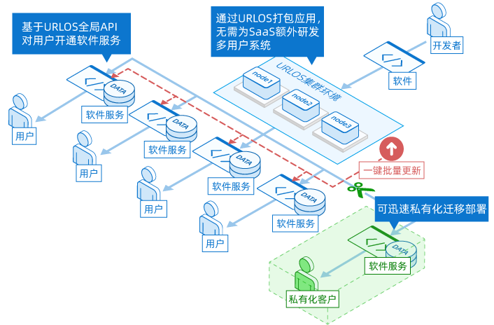

### 1.3 平台构成

软骨鱼SaaS平台由URLOS系统和软骨鱼SaaS系统组成，URLOS主要负责底层服务器集群环境管理；软骨鱼SaaS系统则负责SaaS服务的相关管理，SaaS平台的日常管理主要在软骨鱼SaaS系统中进行。

**后台系统说明：**

| 后台系统名称           | 系统介绍                             | 登录地址                                      |
| ---------------------- | ------------------------------------ | --------------------------------------------- |
| URLOS服务中心          | 用于绑定URLOS的授权                  | https://www.urlos.com/?m=admin&c=user&a=login |
| URLOS                  | 用于管理主机和部署服务               | http://ip:9968 或 https://ip:9966             |
| 软骨鱼SaaS系统后台     | 用于管理SaaS服务和SaaS平台官网       | https://www.xxxxx.com                         |
| 软骨鱼SaaS系统授权中心 | 用于管理软骨鱼授权和SaaS平台短信服务 | https://www.xxxxx.com                         |

----

## 二、安装与部署

### 2.1 环境要求

#### 2.1.1 硬件要求

最低硬件配置：1核CPU，1G内存（1+1）

**推荐硬件配置：2核CPU，8G内存（2+8）**

#### 2.1.2 系统要求

推荐安装系统：Ubuntu-16.04、Ubuntu-18.04、Ubuntu-20.04、Debian9X、Debian10X的X86 64位的纯净的操作系统

**强烈推荐使用Ubuntu-18.0或Debian10X。**

#### 2.1.3 基础设施推荐

| 名称                   | 配置说明                                                     |
| ---------------------- | ------------------------------------------------------------ |
| NFS服务器兼URLOS主控机 | 推荐使用1台2核8GB主机（用于部署NFS服务和安装URLOS）          |
| 管理主机               | 初期推荐1台2核8GB主机，随着用户增长可陆续添加主机（在成本允许的情况下推荐使用3台主机） |
| 数据库                 | 1、可使用URLOS单机版MySQL数据库（在成本允许的情况下推荐使用云数据库） 2、如需具备高可用、低延迟、高抗压能力的数据库服务，可专门使用3台主机部署URLOS的MySQL多主集群（维护成本较高），参见 [多主集群的优缺点](https://blog.csdn.net/educast/article/details/78678152) |
| 负载均衡               | 可使用URLOS管理主机作为负载均衡                              |

### 2.2 安装和部署

#### 2.2.1 单机应用和云应用介绍

在安装之前，须介绍一下软骨鱼SaaS平台软件服务的两种类型：**单机应用**和**云应用**。

> 单机应用：仅固定运行在1台主机上的应用。
>
> 云应用：可同时运行在多台主机上，单机故障不会影响云应用的正常运行。 

##### 功能对比

| 功能           | 普通应用                   | 云应用                                                       |
| -------------- | -------------------------- | ------------------------------------------------------------ |
| 使用限制       | 无使用限制                 | 集群需挂载NFS（可以是本地NFS服务器或阿里云NAS、腾讯云CFS等） |
| 部署和运行方式 | 只能部署和运行在一台主机上 | 可同时部署和运行在集群内的多台主机上                         |
| 应用弹性伸缩   | 不具备应用弹性伸缩能力     | 具备应用弹性伸缩能力，添加主机，则自动增加运行容器，反之则减少运行容器 |
| 故障转移       | 不具备故障转移能力         | 具备故障转移能力，主机遇故障，则容器自动转移至健康主机       |
| 快照备份       | 支持快照备份               | 不支持快照备份                                               |

#####　优劣对比

| 应用类型 | 优点                                                         | 缺点                                                    |
| -------- | ------------------------------------------------------------ | ------------------------------------------------------- |
| 单机应用 | 硬件成本更低；使用本地存储文件，文件读写速率更快；支持快照备份。 | 不支持应用弹性伸缩，不支持故障转移。                    |
| 云应用   | 多台主机运行，抗压能力更强；支持应用弹性伸缩和故障转移，可用性更高。 | 不支持快照备份，受限于NFS设备的IO速率和内网带宽的大小。 |

#### 2.2.2 单机应用

##### 第1步：安装URLOS

**1、登陆操作系统：**

使用ssh客户端工具登录系统，如果登录用户不是root，则执行`sudo -s`命令切换到root用户；

**2、下载安装脚本并执行安装命令：**

**集群模式**（如果有多台主机组集群，则可以使用集群模式，该模式支持弹性伸缩、故障自动转移和负载均衡等高级功能）：

```bash
curl -O https://www.urlos.com/iu && sh iu
```

> [!NOTE] 1、如果系统中没有curl工具，则需先执行`apt-get install -y curl || yum -y install curl`安装curl；
>
> 2、如需提前体验Beta版，可在安装命令结尾加上相应的版本号，如安装1.3.0.3-beta：
>
> `curl -O https://www.urlos.com/iu && sh iu 1.3.0.3-beta` 　[查看所有Beta版本](https://hub.docker.com/r/urlos/urlos/tags?page=1&name=beta&ordering=last_updated)
>
> ３、单机模式转集群模式，请参见 [单机模式转集群模式](../tips/change-cluster.md)

**3、选择服务器所在区域：**

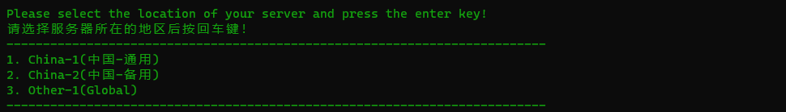

服务器在中国选**1**，如果下载过程比较缓慢，则选**2**，如果服务器在海外则选**3**，然后按回车；

**4、选择数据的存储目录：**


请选择数据的存储目录，通常为数据盘的挂载目录，然后按回车；

**5、安装成功并重启服务器：**

安装完成后可能会自动重启服务器，重启过程一般需要1分钟左右；

**6、访问并使用URLOS：**

请在防火墙（或安全组）中开放9966，9967，9968，9969端口（入站规则），然后使用浏览器访问`https://你的服务器IP:9966`或`http://你的服务器IP:9968`访问URLOS；用户名：urlos，密码为随机生成，请留意安装成功信息，如下图：

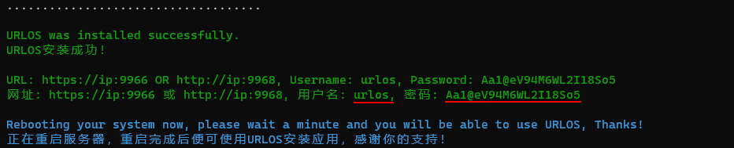

如安装完成后忘记密码，请参见 [初始化URLOS密码](../problem/problem002.md)

> [!TIP]
>
> 1. URLOS同时支持HTTPS和HTTP协议进行访问，但我们强烈推荐你使用HTTPS协议，因为HTTP协议非常不安全，很容易被抓包从而导致密码泄露！
> 2. 付费版本需绑定授权密钥才能正常使用，详情请参见 [授权码绑定](../install/code-binding.md)。

##### 第2步：添加集群

**添加集群**

1、打开 “`硬件 -> 集群管理`”，点击“添加集群”按钮

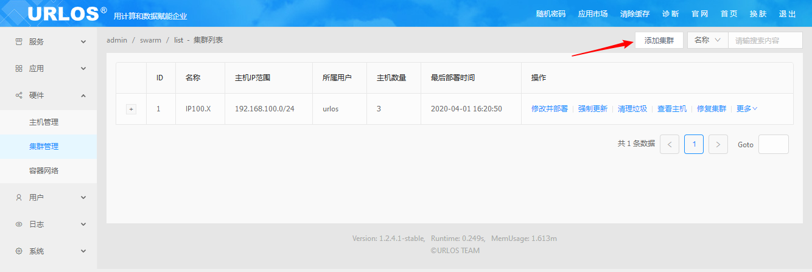

2、在`基本信息`中依次填写集群名称，如“中国-广州-电信-01号机房-50号机柜”，主机IP范围请填写服务器内网网段，若当前服务器内网IP为“`192.168.1.1`”，则主机IP范围可以填写为“`192.168.1.0/24`”，即集群的IP范围可以从192.168.1.0 至 192.168.1.255。

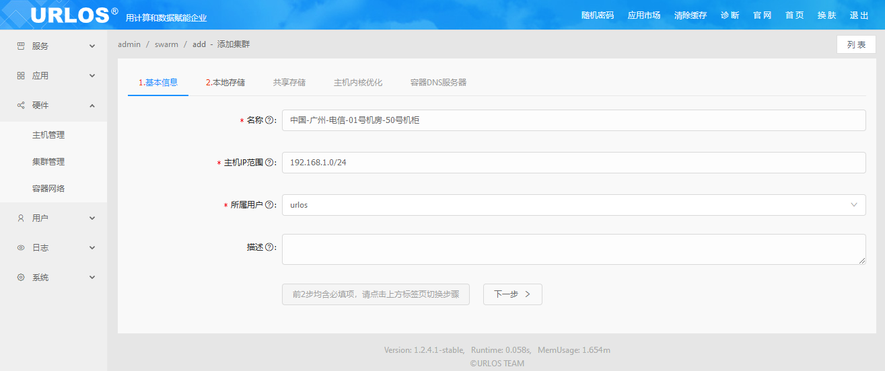

3、在`本地存储`中填写本地存储目录，通常为数据盘的的挂载目录，如`/data/`, `/home/`

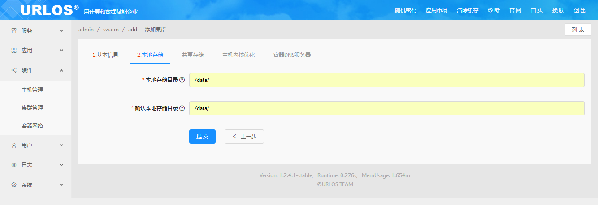

##### 第3步：添加主机

1、打开 “`硬件 -> 主机管理`”，点击“添加主机”按钮

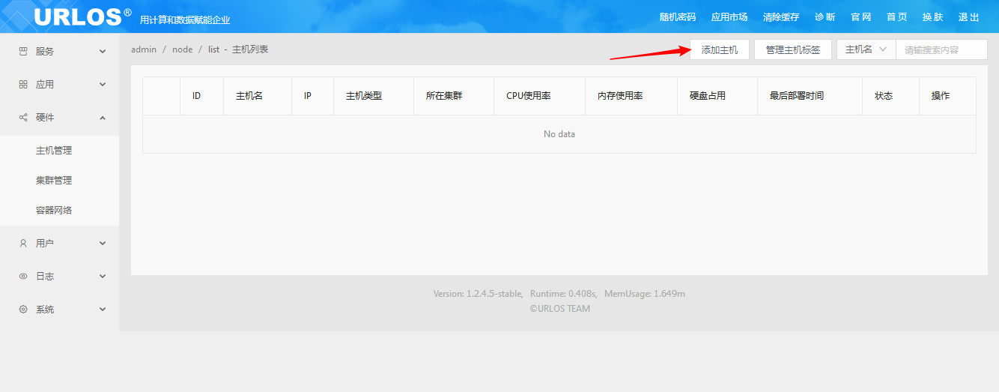

2、在基本信息中填写主机名称、主机ip、选择所在集群、类型选择管理主机+工作主机、状态选择开启。

什么是**管理主机**和**工作主机**？参见 [管理主机和工作主机](https://www.urlos.com/urlos-document/tips/load-balancing.html)

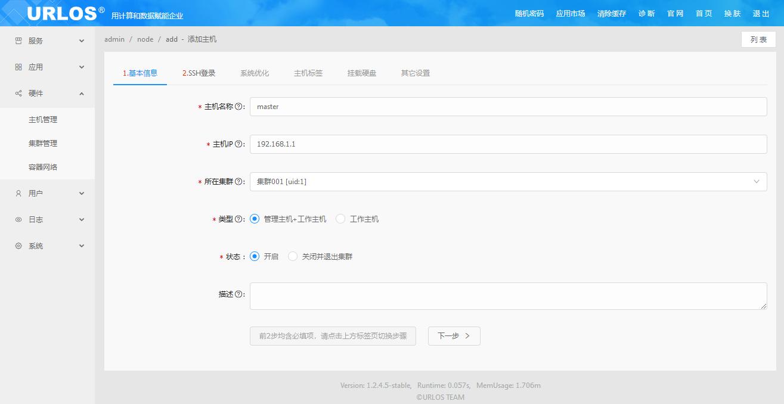

3、在`SSH登录`中填写用户名和密码。

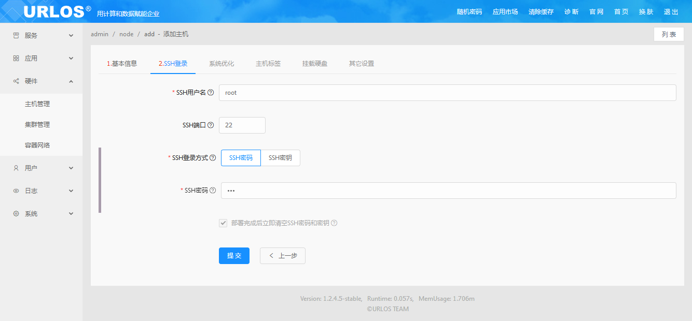

至此，点击提交按钮，完成添加主机。

##### 第4步：安装软骨鱼单机版

####  2.2.3 云应用

##### 第1步：部署NFS

**安装NFS相关包**，以Ubuntu18.04为例：

```bash
apt-get install nfs-kernel-server nfs-common
```

**配置NFS目录和权限**

新建`/nfsdir`作为共享存储目录：

```bash
mkdir /nfsdir && chmod -R 777 /nfsdir/
```

修改NFS配置

```bash
vim /etc/exports
```

在最后一行添加`/nfsdir 192.168.1.0/24(rw,no_subtree_check,root_squash,no_all_squash,insecure)`，其中的`192.168.1.0/24`即集群IP范围。

补充：

> \# 将远程访问的所有普通用户及所属组都映射为匿名用户或用户组（nfsnobody）
>
> ```bash
> /nfsdir 192.168.1.0/24(rw,no_subtree_check,root_squash,no_all_squash,insecure)
> ```
>
> \# 将数据同步写入内存缓冲区与磁盘中，效率低，但可以保证数据的一致性
>
> \# 不将root用户及所属组都映射为匿名用户或用户组（默认设置）
>
> ```bash
> /nfsdir 192.168.1.0/24(rw,no_subtree_check,root_squash,no_all_squash,insecure)
> ```

**重启服务**

```bash
/etc/init.d/nfs-kernel-server restart
```

这样NFS服务已经部署完毕。

##### 第2步：安装URLOS

**1、登陆操作系统：**

使用ssh客户端工具登录系统，如果登录用户不是root，则执行`sudo -s`命令切换到root用户；

**2、下载安装脚本并执行安装命令：**

**集群模式**（如果有多台主机组集群，则可以使用集群模式，该模式支持弹性伸缩、故障自动转移和负载均衡等高级功能）：

```bash
curl -O https://www.urlos.com/iu && sh iu
```

> [!NOTE] 1、如果系统中没有curl工具，则需先执行`apt-get install -y curl || yum -y install curl`安装curl；
>
> 2、如需提前体验Beta版，可在安装命令结尾加上相应的版本号，如安装1.3.0.3-beta：
>
> `curl -O https://www.urlos.com/iu && sh iu 1.3.0.3-beta` 　[查看所有Beta版本](https://hub.docker.com/r/urlos/urlos/tags?page=1&name=beta&ordering=last_updated)
>
> ３、单机模式转集群模式，请参见 [单机模式转集群模式](../tips/change-cluster.md)

**3、选择服务器所在区域：**


服务器在中国选**1**，如果下载过程比较缓慢，则选**2**，如果服务器在海外则选**3**，然后按回车；

**4、选择数据的存储目录：**


请选择数据的存储目录，通常为数据盘的挂载目录，然后按回车；

**5、安装成功并重启服务器：**

安装完成后可能会自动重启服务器，重启过程一般需要1分钟左右；

**6、访问并使用URLOS：**

请在防火墙（或安全组）中开放9966，9967，9968，9969端口（入站规则），然后使用浏览器访问`https://你的服务器IP:9966`或`http://你的服务器IP:9968`访问URLOS；用户名：urlos，密码为随机生成，请留意安装成功信息，如下图：


如安装完成后忘记密码，请参见 [初始化URLOS密码](../problem/problem002.md)

> [!TIP]
>
> 1. URLOS同时支持HTTPS和HTTP协议进行访问，但我们强烈推荐你使用HTTPS协议，因为HTTP协议非常不安全，很容易被抓包从而导致密码泄露！
> 2. 付费版本需绑定授权密钥才能正常使用，详情请参见 [授权码绑定](../install/code-binding.md)。

##### 第3步：添加集群并挂载NFS

**添加集群**

1、打开 “`硬件 -> 集群管理`”，点击“添加集群”按钮


2、在`基本信息`中依次填写集群名称，如“中国-广州-电信-01号机房-50号机柜”，主机IP范围请填写服务器内网网段，若当前服务器内网IP为“`192.168.1.1`”，则主机IP范围可以填写为“`192.168.1.0/24`”，即集群的IP范围可以从192.168.1.0 至 192.168.1.255。


3、在`本地存储`中填写本地存储目录，通常为数据盘的的挂载目录，如`/data/`, `/home/`


**挂载NAS**

在`共享存储`卡片下填写“本地挂载目录”，推荐使用二级目录，如`/nfs-data/data01/`，“NFS主机”填写入之前部署的NFS主机的内网IP，“NFS共享目录”填写部署NFS时设置的目录`/nfsdir`，其他默认即可，然后点击提交按钮，等待部署完成。

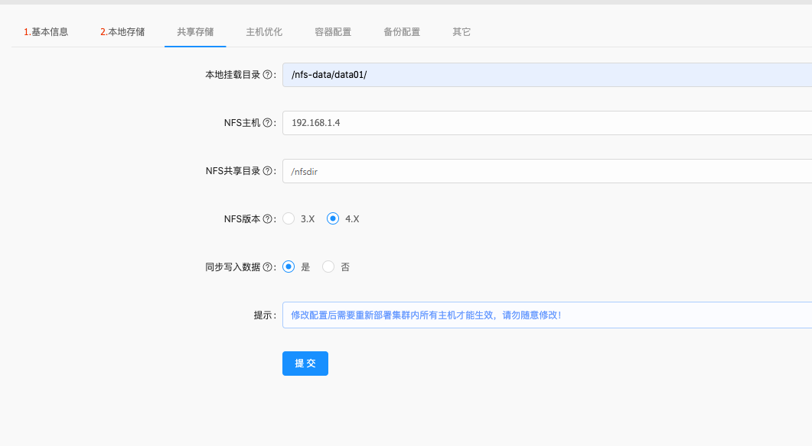

##### 第4步：添加主机

1、打开 “`硬件 -> 主机管理`”，点击“添加主机”按钮


2、在基本信息中填写主机名称、主机ip、选择所在集群、类型选择管理主机+工作主机、状态选择开启。

什么是**管理主机**和**工作主机**？参见 [管理主机和工作主机](https://www.urlos.com/urlos-document/tips/load-balancing.html)


3、在`SSH登录`中填写用户名和密码。


至此，点击提交按钮，完成添加主机。

##### 第5步：安装数据库服务

可使用URLOS单机版mysql数据库，在成本允许的情况下推荐使用云数据库。

**使用URLOS部署单机版数据库**

打开 “**服务** > **数据存储**”，首次安装时，程序会自动跳转至数据库应用界面，我们以MySQL5.7为例，点击“**安装**”按钮：

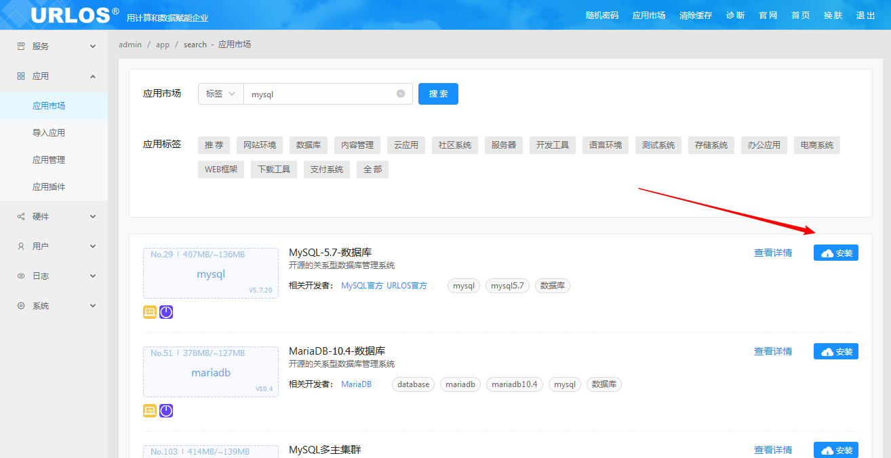

在`基本信息`中填写服务名称、选择运行主机、部署方式选择智能部署，服务端口即对外服务端口，一般默认填写3306，然后设置数据库密码，点击提交：

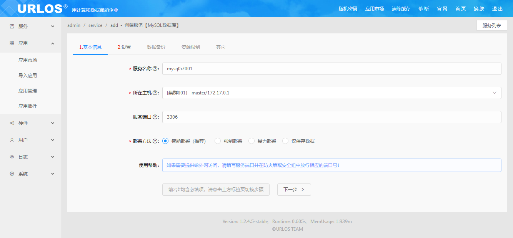

在设置中填写数据库root用户的密码：

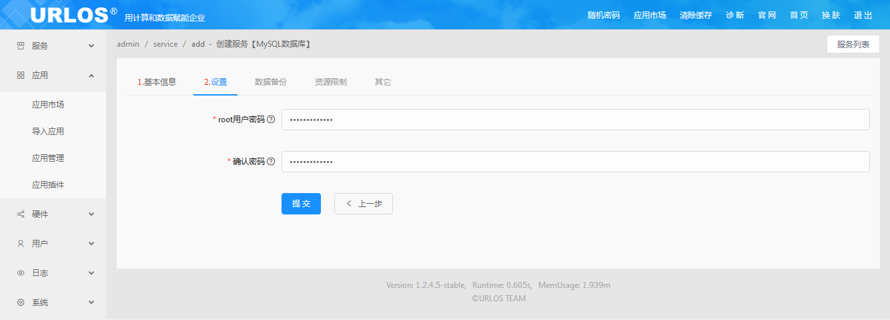

点击提交按钮，完成数据库安装。

> [!NOTE]
>
> 但凡在URLOS中填写的端口号，请确保已经设置为开启状态，一般情况下在云主机商提供的管理面板中添加规则到安全组即可。

 

**部署云数据库**

云数据库部署请参考：

[阿里云数据库 RDS使用流程](https://help.aliyun.com/product/26090.html)

[腾讯云数据库 MySQL入门概述](https://cloud.tencent.com/document/product/236/46908)

##### 第6步：安装软骨鱼云存储版

## 三、软件SaaS化入门

### 3.1 镜像打包

### 3.2 应用制作

### 3.3 应用审核

### 3.4 添加商品

----

## 四、软骨鱼SaaS系统入门

软骨鱼SaaS系统包含前台官网和后台管理系统

### 4.1 系统设置

#### 4.1.1 官网LOGO

首先，在 “**官网 -> 附件管理**” 中添加LOGO图片

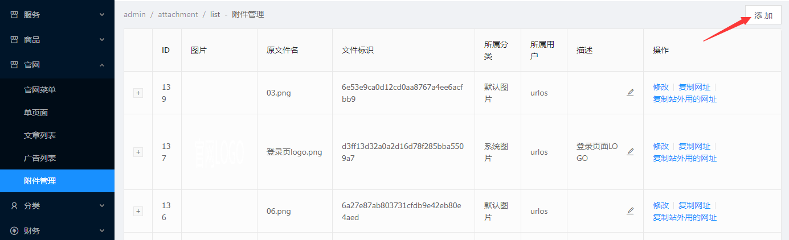

为了便于图片维护和管理，建议将图片分类改成“**系统图片**”，并为其添加描述“**官网前台logo**”

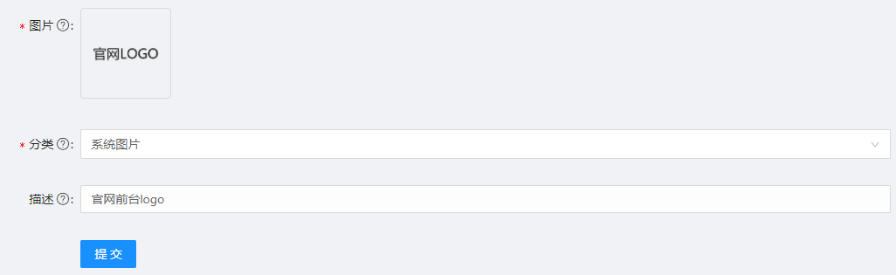

提交之后，在附加列表中复制LOGO图片的网址

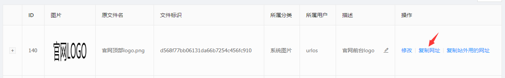

然后在“**系统设置**”中找到“**网站顶部LOGO图片网址**”

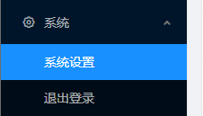


将图片网址粘贴到选项值中即可

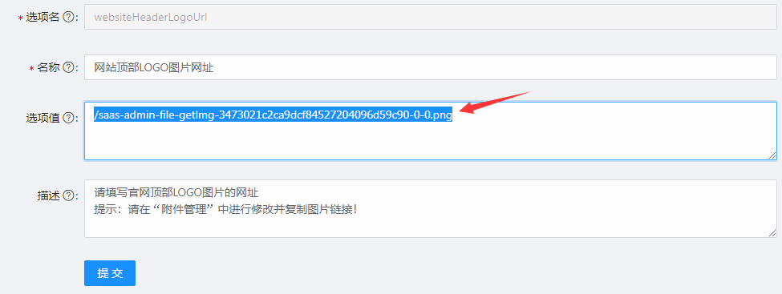

请使用同样的方法替换后台LOGO（请注意：前台LOGO为深色系，后台LOGO为白色）。

#### 4.1.2 官网名称

在“**系统设置**”中找到“**网站名称**”，在选项值中填写网站名称

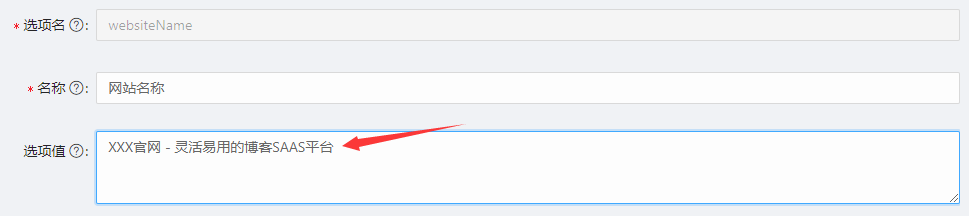

#### 4.1.3 公司名称

在“**系统设置**”中找到“**公司名称**”，在选项值中填写公司名称

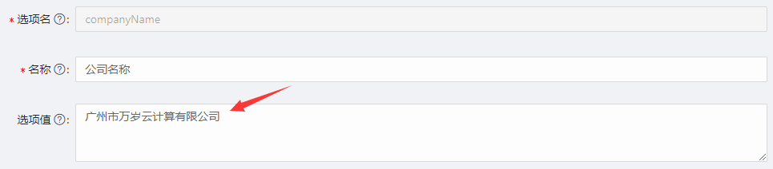

#### 4.1.4 备案号

在“**系统设置**”中找到“**备案号**”，在选项值中填写网站备案号

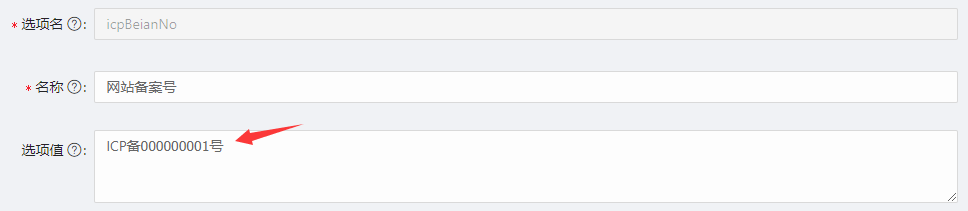

<div id ="4.1.5"></div>

#### 4.1.5 基础域名 

基础域名，可理解为软件服务的“根域名”，主要用于软件服务开通时自动分配子域名。例如，如果基础域名设置为“**test.urlos.com**”，则开通网站时自动分配的子域名是“**fg342ijf8313p.test.urlos.com**”，子域名的前缀是自动生成的。

**注意：使用软骨鱼SaaS系统时，必须将默认的测试域名替换为自己的域名，并将域名A记录解析至URLOS管理主机的外网ip**


### 4.2 官网

#### 4.2.1 官网菜单

**菜单：指前台页面中的头部导航菜单和底部页脚菜单。**

系统默认的菜单分别是首页、文档、定价、关于、关于我们、技术支持。一般情况下无需修改菜单内容，特别是不建议修改跳转链接。


**各频道对应链接如下：**

| 频道名称 | 频道链接                                      |
| -------- | --------------------------------------------- |
| 文章列表 | /saas-home-article-list-w-s-y.html            |
| 商品列表 | /saas-home-app-list-w-s-y.html                |
| 关于我们 | /saas-home-singlePage-detail-aboutUs-s-y.html |

#### 4.2.2 单页面

单页面：指可自定义页面内容的页面，单页面内容支持自定义html代码。

首先了解一下单页面结构：

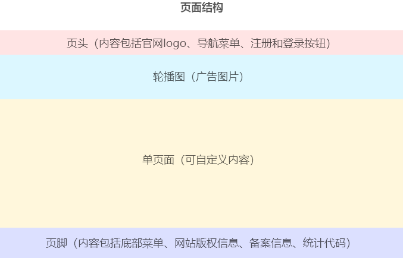

上图黄色区域即单页面的可编辑区域。

单页面结构可以通过`模板`来定义，在二次开发的时候经常使用到。

目前，官网首页、关于我们、专题页面都是通过单页面的方式实现，并且我们已经为用户提供预设展示内容，用户只需在编辑器中修改文字和替换图片即可。

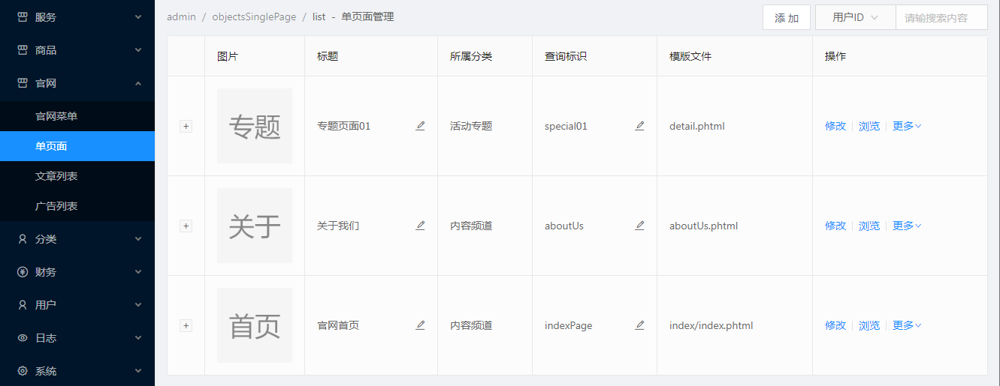

官网首页预设展示内容：


有能力的用户可自行编辑html代码：

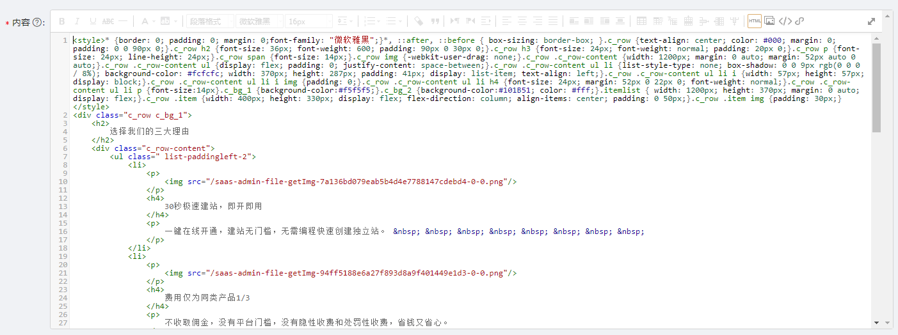

除了定义页面展示内容，单页面还能定义页面的SEO，例如首页SEO定义如下：

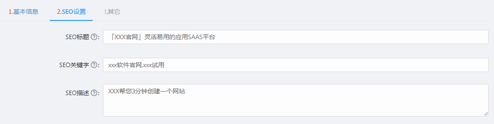

#### 4.2.3 广告列表

在广告列表中可管理前台所有页面的广告图片内容，例如：首页轮播图、定价页轮播图、文章页轮播图等。

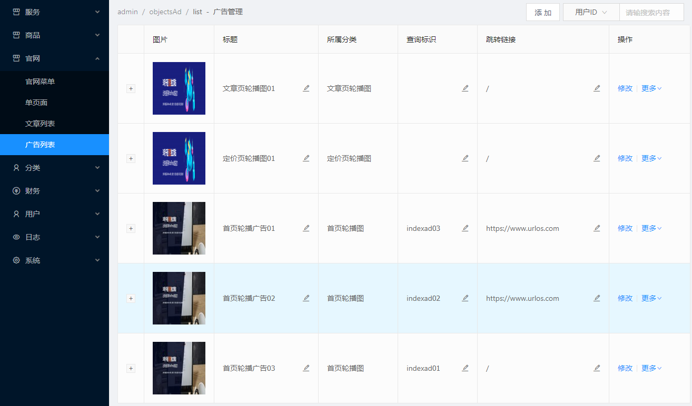

#### 4.2.4 文章列表

文章列表可管理官网的文章内容，系统默认的两大分类为`新闻资讯`和`使用手册`。

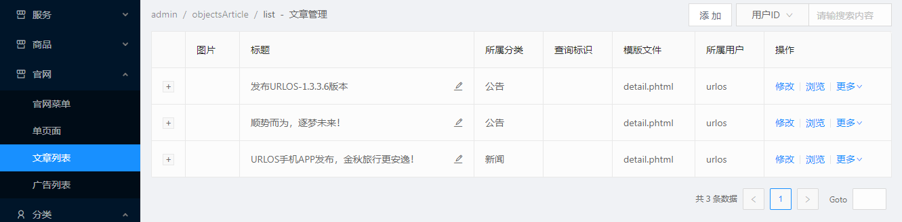

----

### 4.3 商品

目前软骨鱼SaaS平台的商品主要以软件应用为主，只要是在URLOS中发布上架的应用，基本都可以被添加为商品。

#### 4.3.1 添加商品

例如，把URLOS中的**wordpress**应用添加成为软骨鱼SaaS平台的商品，具体操作步骤如下：

1、在URLOS`应用开发`中找到**wordpress**应用，得到应用的ID为**18**：

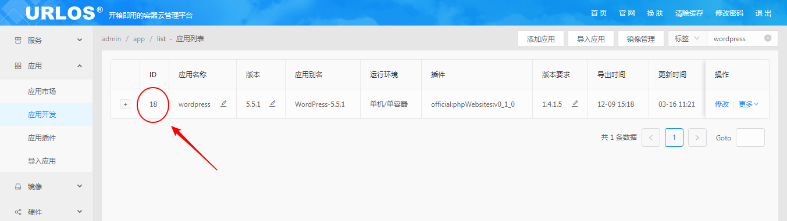

2、在软骨鱼系统中添加商品

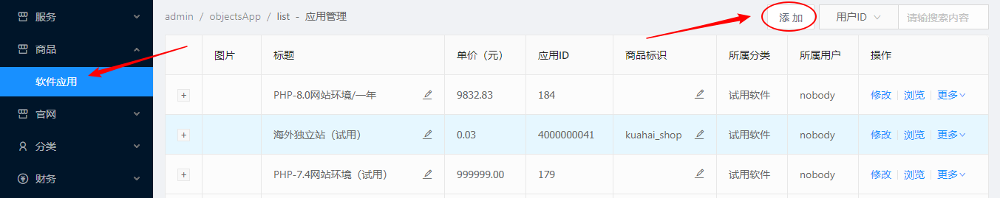

3、填写对应的应用ID：18

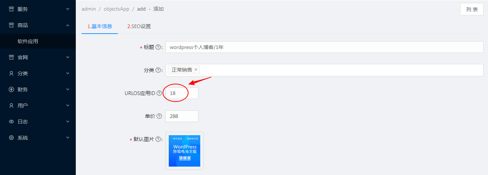

4、编辑商品标题、商品图片、商品描述和SEO之后，编辑提交按钮即可。

后台商品展示：


前台商品展示：

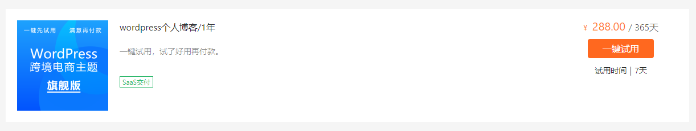

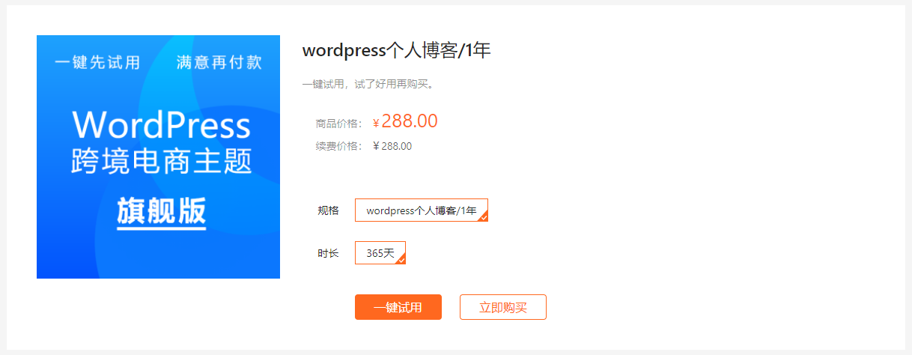

#### 4.3.2 开启试用

软骨鱼SaaS平台的主要特色就在于一键试用，我们在商品管理中可将任意商品快速开启试用模式。

例如，开启wordpress的一键试用：

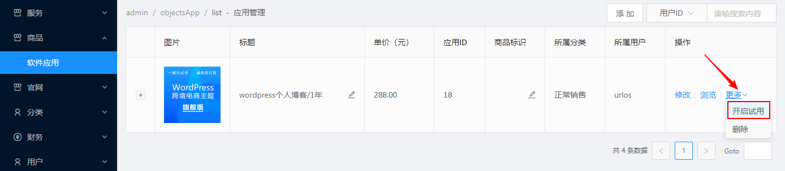

点击开启试用后，系统以该商品为模板自动创建出一个价格为0元的试用商品

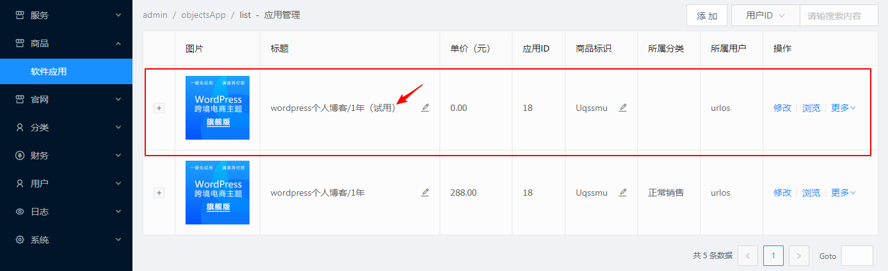

前台商品展示：

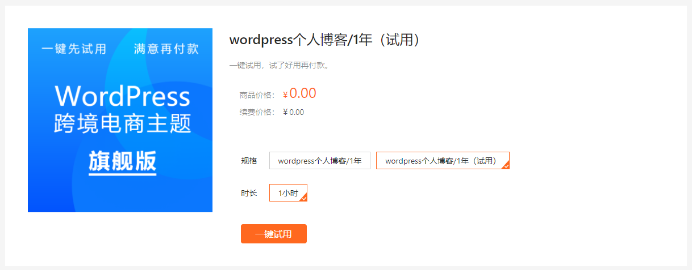

### 4.4 服务

#### 4.4.1 添加服务

用户可在前台购买软件服务，购买成功后系统自动开通服务；另外，系统管理员也可以在后台直接开通服务，点击右上角的【添加】按钮，在弹出对话框中进行相应设置即可：

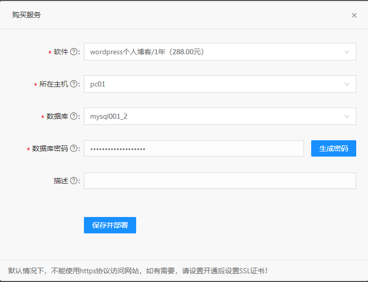

#### 4.4.2 管理服务

在服务列表中可查看和管理用户开通的软件服务，系统管理员可针对不同软件服务进行操作。

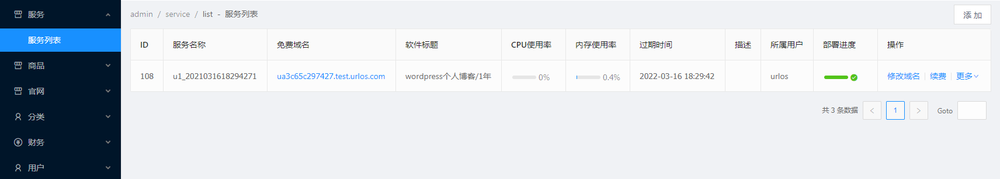

**系统管理员各项操作的简要说明：**

> 修改域名：指修改当前软件服务的访问域名，系统在创建服务时已经为其分配了一个免费域名（请参考：[设置基础域名](#4.1.5)）；
>
> 续费：指为当前软件服务进行延期续费；
>
> 重启：指重新启动当前软件服务，一般在软件服务遇到问题时，可使用重启服务进行修复，重启时会中断软件服务，请慎用；
>
> 关闭：指关闭当前软件服务，软件服务在服务列表中不会被删除，也不会删除网站相关数据；
>
> 删除：指删除当前软件服务，删除后在服务列表中不再显示该软件服务，但不会删除网站相关数据；
>
> 修改SSL证书：指为当前软件服务更换域名SSL证书；
>
> 防爆限流：指为当前软件服务开启攻击防护功能，具体是指限制每IP在一定时间的总请求数，对非浏览器访问直接过滤，建议在遭遇恶意攻击时开启！

### 4.5 分类

软骨鱼SaaS平台中的分类按类型划分为：商品分类、文章分类、广告分类，默认情况下无需进行修改即可使用。

另外，如果“**分类标识**”中包含“**sys__**”字符，表示该分类属于系统标签，切不可删除或修改标识，以免前台内容展示出现问题。

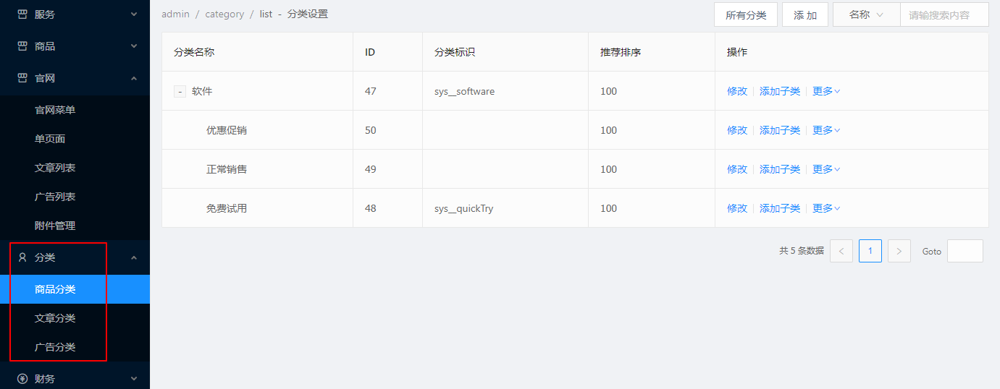

### 4.6 财务

#### 4.6.1 订单列表

订单列表用于统一管理租户订单，随时掌握SaaS平台交易情况。订单列表支持按订单号、用户ID查询订单，还可以查看当前订单的详细流水记录。

订单与流水是一对多的关系，即一个订单之中可能关联多条交易流水，例如一个订单包含多个商品的情况。

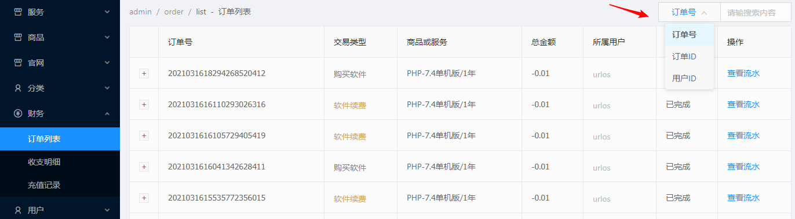

#### 4.6.2 收支明细

收支明细中记录了全平台所有的交易流水记录。系统管理员可在当前页面为平台用户代充余额。

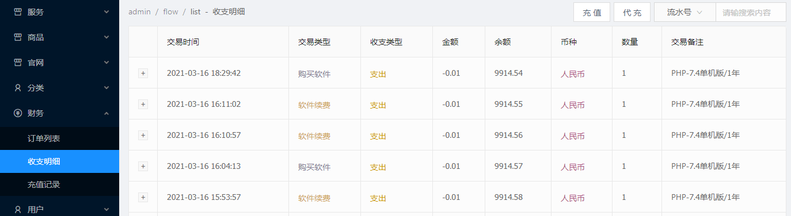

代充余额

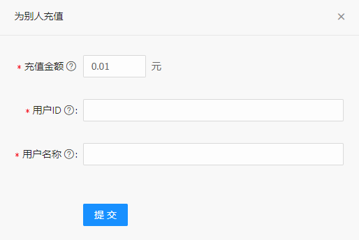

#### 4.6.3 充值记录

充值记录中记录了全平台所有用户的充值记录。系统管理员可在当前页面为平台用户代充余额。

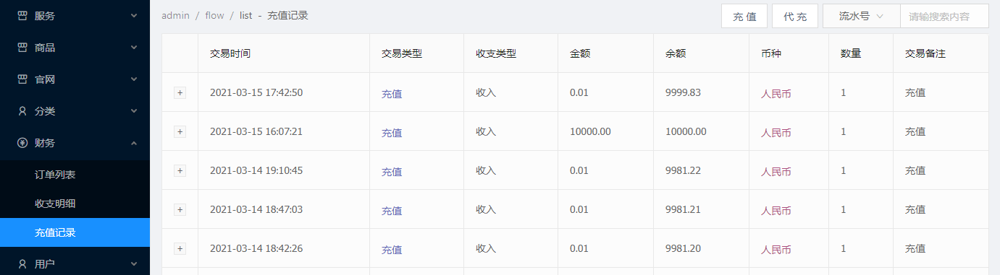